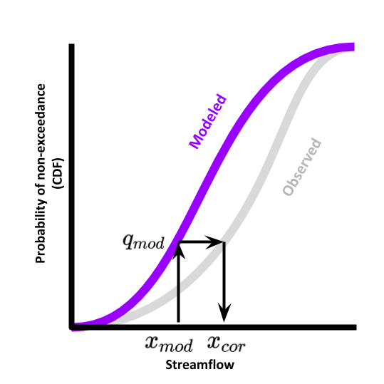

Bias Correction **(IN PROGRESS)**
=================================

This page documents the implementation of
**bmorph** bias correction for streamflow
data in a watershed. An example workflow notebook
can be found in ``bmorph_tutorial``.

bmorph Overview
---------------

.. image:: scenario_table.png
    :alt: 

Independent Bias Correction: Univariate (IBC_U)
^^^^^^^^^^^^^^^^^^^^^^^^^^^^^^^^^^^^^^^^^^^^^^^

Univariated Independent Bias Correction (IBC_U) is considered the traditional bias correction method implemented here as described in `EDCDFm`_. This method can only be performed at sites with refernce data, which is useful when gauge sites can measure flows but does not gaurentee spatially consitent corrections amongst a series of gauge sites. None the less, it performs best out of all four methods at the gauge sites where it can correct, but may introduce spatial incongruties across sites.

Independent Bias Correction: Conditioned (IBC_C)
^^^^^^^^^^^^^^^^^^^^^^^^^^^^^^^^^^^^^^^^^^^^^^^^

Similar to IBC_U, Conditioned Independent Bias Correction (IBC_C) can only apply corrections at gauge sites where there is refence flow data. IBC_C integrates meterologic data into the ``bmorph`` bias correction process as described in `mDCDEDCDFm`_. Conditioning allows hydrologic process based knowledge to be included in the bias correction process that can help to root bias corrections in meterologic trends. 

Spatially Consistent Bias Correction: Univariate (SCBC_U)
^^^^^^^^^^^^^^^^^^^^^^^^^^^^^^^^^^^^^^^^^^^^^^^^^^^^^^^^^

Univariate Spatially Consistent Bias Correction (SCBC_U) aims to address IBC's inability to correct flows at non-gauge sites where reference timeseries do not exist.

Spatially Consistent Bias Correction: Conditioned (SCBC_C)
^^^^^^^^^^^^^^^^^^^^^^^^^^^^^^^^^^^^^^^^^^^^^^^^^^^^^^^^^^

bmorph Parameters
-----------------

Conditioning: edcdfm vs mdcdedcdfm
^^^^^^^^^^^^^^^^^^^^^^^^^^^^^^^^^^

EDCDFm
""""""

Before describing how conditioning is integrated into ``bmorph`` bias correction, we need to discuss the standard method. 
``bmorph`` implements part of PresRat bias correction from Pierce et al. (2015; http://dx.doi.org/10.1175/JHM-D-14-0236.1), which is an extension of Equidistant quantile matching (EDCDFm) technique of Li et al. (2010; http://dx.doi.org/10.1029/94JD00483). ``bmorph`` uses the amended EDCDFm to compute multiplicative changes in the quantiles of a Cumulative Distribution Fuction (CDF). Here, only flow values are used to construct the CDFs. 

mDCDEDCDFm
""""""""""

multiDimensional ConDitional EquiDistant CDF matching function, (mDCDEDCDFm), incorporates meteorlogic data into the ``bmorph`` bias correction process to condition flow time series to other hydrologically relevant information. By creating a series of CDFs based on meteorlogic data, (such as minimum daily temperature), ``bmorph`` can select a CDF that will not only correct the time series, but most closely match the metrologic conditions simulated.
    
.. image:: Figures/conditioning_diagram_with_arrows.png
    :alt: Multidimensional CDF functions are shown has heat maps with raw taking up left and refernce taking up center. A cumulative proability plot compares raw model CDF and Reference flow CDF for one meterologic slice of the heatmaps left of it. Arrows demonstrate mapping the reference data in the heat maps to the raw model data for bias correction.

.. math::

    \tilde{x_{mp}} = x_{mp} + F^{-1}_{oc}(F_{mp}(x_{mp}|y_{mp})|y_{oc})
                            - F^{-1}_{mc}(F_{mp}(x_{mp}|y_{mp})|y_{mc})

bmorph Workflows
----------------

run_parallel_bmorph
^^^^^^^^^^^^^^^^^^^

run_parallel_scbc
^^^^^^^^^^^^^^^^^

apply_interval_blendmorph
^^^^^^^^^^^^^^^^^^^^^^^^^

