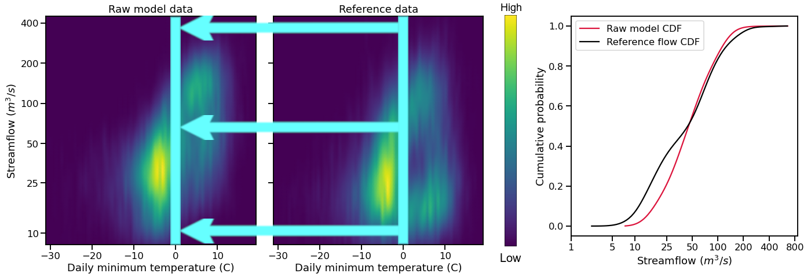

Bias Correction
===============

This page documents the implementation of
**bmorph** bias correction for streamflow
data in a watershed. An example workflow notebook
can be found in ``bmorph_tutorial``.

bmorph Overview
---------------

                       +-------------------------+-----------------+
                       | Spatially Consistent BC | Independent BC  |
                       |         (SCBC)          |      (IBC)      |
+----------------------+-------------------------+-----------------+
| Unconditional BC (U) |         SCBC_U          |      IBC_U      |
+----------------------+-------------------------+-----------------+
|  Conditional BC (C)  |         SCBC_C          |      IBC_C      |
+----------------------+-------------------------+-----------------+

Independent Bias Correction: Univariate (IBC_U)
^^^^^^^^^^^^^^^^^^^^^^^^^^^^^^^^^^^^^^^^^^^^^^^

Univariated Independent Bias Correction (IBC_U) is considered the traditional bias correction method implemented here as described in `EDCDFm`_. This method can only be performed at sites with refernce data, which is useful when gauge sites can measure flows but does not gaurentee spatially consitent corrections amongst a series of gauge sites. None the less, it performs best out of all four methods at the gauge sites where it can correct, but may introduce spatial incongruties across sites.

`Workflow workflow`_ : ``apply_annual_bmorph``, ``apply_interval_bmorph``

Independent Bias Correction: Conditioned (IBC_C)
^^^^^^^^^^^^^^^^^^^^^^^^^^^^^^^^^^^^^^^^^^^^^^^^

Similar to `IBC_U <Independent Bias Correction: Univariate (IBC_U)>`_, Conditioned Independent Bias Correction (IBC_C) can only apply corrections at gauge sites where there is refence flow data. IBC_C integrates meterologic data into the ``bmorph`` bias correction process as described in `mDCDEDCDFm`_. Conditioning allows hydrologic process based knowledge to be included in the bias correction process that can help to root bias corrections in meterologic trends. 

`Workflow workflow`_ : ``apply_annual_bmorph``, ``apply_interval_bmorph``

Spatially Consistent Bias Correction: Univariate (SCBC_U)
^^^^^^^^^^^^^^^^^^^^^^^^^^^^^^^^^^^^^^^^^^^^^^^^^^^^^^^^^

Univariate Spatially Consistent Bias Correction (SCBC_U) aims to address IBC's inability to correct flows at non-gauge sites where reference timeseries do not exist. Spatial consistency is conserved by performing bias corrrections at every river segement, or `seg <data.rst/Common Naming Conventions>`_, and then rerouting the corrected flows through `mizuroute <https://mizuroute.readthedocs.io/en/latest/`_. Reference data for each seg that is not a gauge site is done by creating proxy reference data for each seg from upstream and downstream proxy gauge flows that can be combinded, or blended, together to create what the reference flow data for that seg should look like, as described in `Spatial Conistency: Reference Site Selection & CDF Blend Factor <data.rst/Spatial Consistency: Reference Site Selection & CDF Blend Factor>`_. 

`Workflow workflow`_ : ``apply_annual_blendmorph``, ``apply_interval_blendmorph``

Spatially Consistent Bias Correction: Conditioned (SCBC_C)
^^^^^^^^^^^^^^^^^^^^^^^^^^^^^^^^^^^^^^^^^^^^^^^^^^^^^^^^^^

Conditioned Spatially Consistent Bias Correction (SCBC_C) combines the meterlogic conditioning elements of `IBC_C <Independent Bias Correction: Conditioned (IBC_C)>`_ with the spatial consistency of `SCBC_U <Spatially Consistent Bias Correction: Univariate (SCBC_U)>`_. This implementation of SCBC factors in meterologic variables given into the formulation of refernce flows for each seg to be corrected to. Defined by the hydrologic response units, or <hru's <data.rst/Common Naming Conventions>`_, they impact, meterologic data is mappable to each seg within the watershed topology. In `IBC_C <Independent Bias Correction: Conditioned (IBC_C)>`_, only the data mapped to gauge sites would be used in bias correction, whereas SCBC_C can utilize meterologic data across the watershed as it incoporates all defined segs. 

`Workflow workflow`_ : ``apply_annual_blendmorph``, ``apply_interval_blendmorph``

.. _`Workflow workflow`: https://bmorph.readthedocs.io/en/develop/api.html#module-bmorph.core.workflows

bmorph Parameters
-----------------

Conditioning: edcdfm vs mdcdedcdfm
^^^^^^^^^^^^^^^^^^^^^^^^^^^^^^^^^^

EDCDFm
""""""

Before describing how conditioning is integrated into ``bmorph`` bias correction, we need to discuss the standard method. 
``bmorph`` implements part of PresRat bias correction from Pierce et al. (2015), which is an extension of Equidistant quantile matching (EDCDFm) technique of Li et al. (2010). ``bmorph`` uses the amended EDCDFm to compute multiplicative changes in the quantiles of a Cumulative Distribution Fuction (CDF). Here, only flow values are used to construct the CDFs. 

.. image:: Figures/Mapping_Diagrams_Pierce.PNG
    :alt: Figure 1 from Pierce et al. (2015). Describes differences in bias correction techniques between Quantile Mapping, EDCDFm, CDF-t, and all methods combined with PresRat.

Above, Pierce et al (2010) depicts how Quantile Mapping, EDCDFm, and CDF-t are performed and compare in bias correction methods to PresRat.

mDCDEDCDFm
""""""""""

multiDimensional ConDitional EquiDistant CDF matching function, (mDCDEDCDFm), incorporates meteorlogic data into the ``bmorph`` bias correction process to condition flow time series to other hydrologically relevant information. By creating a series of CDFs based on meteorlogic data, (such as minimum daily temperature), ``bmorph`` can select a CDF that will not only correct the time series, but most closely match the metrologic conditions simulated.
    
te mapping the reference data in the heat maps to the raw model data for bias correction.

.. math::

    \tilde{x_{mp}} = x_{mp} + F^{-1}_{oc}(F_{mp}(x_{mp}|y_{mp})|y_{oc})
                            - F^{-1}_{mc}(F_{mp}(x_{mp}|y_{mp})|y_{mc})
                            
Citations
---------

Pierce, D. W., Cayan, D. R., Mauerer, E. P., Abatzoglou J. T., & Hegewisch, K. C. (2015). Improved Bias Correction Techniques for Hydrological Simulations of Climate Change. *Journal of Hydrometeorology, 16*(6), 2421-2442. http://dx.doi.org/10.1175/JHM-D-14-0236.1_

Li, H., Sheffield, J.,  & Wood, E. F. (2010). Bias correction of monthly precipitation and temperature fields from Intergovernmental Panel on Climate Change AR4 models using equidistant quantile matching. *Journal of Geophysical Research: Atmospheres, 115*(D10), 1-20. https://doi.org/10.1029/2009JD012882_