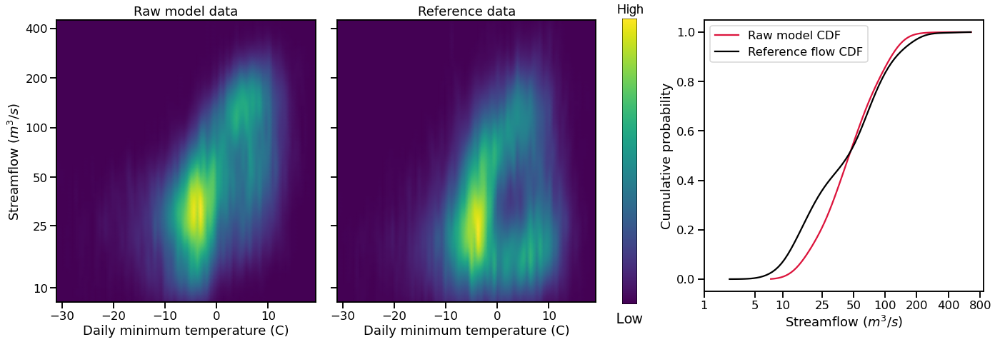

Bias Correction **(IN PROGRESS)**
=================================

This page documents the implementation of
**bmorph** bias correction for streamflow
data in a watershed. An example workflow notebook
can be found in ``bmorph_tutorial``.

bmorph Overview
---------------

.. image:: scenario_table.png

Independent Bias Correction: Univariate (IBC_U)
^^^^^^^^^^^^^^^^^^^^^^^^^^^^^^^^^^^^^^^^^^^^^^^

Independent Bias Correction: Conditioned (IBC_C)
^^^^^^^^^^^^^^^^^^^^^^^^^^^^^^^^^^^^^^^^^^^^^^^^

Spatially Consistent Bias Correction: Univariate (SCBC_U)
^^^^^^^^^^^^^^^^^^^^^^^^^^^^^^^^^^^^^^^^^^^^^^^^^^^^^^^^^

Spatially Consistent Bias Correction: Conditioned (SCBC_C)
^^^^^^^^^^^^^^^^^^^^^^^^^^^^^^^^^^^^^^^^^^^^^^^^^^^^^^^^^^

bmorph Parameters
-----------------

Conditioning: edcdfm vs mdcdedcdfm
^^^^^^^^^^^^^^^^^^^^^^^^^^^^^^^^^^

EDCDFm
""""""

Before describing how conditioning is integrated into ``bmorph`` bias correction, we need to discuss the standard method. 
``bmorph`` implements part of PresRat bias correction from Pierce et al. (2015; http://dx.doi.org/10.1175/JHM-D-14-0236.1), which is an extension of Equidistant quantile matching (EDCDFm) technique of Li et al. (2010; http://dx.doi.org/10.1029/94JD00483). ``bmorph`` uses the amended EDCDFm to compute multiplicative changes in the quantiles of a Cumulative Distribution Fuction (CDF). Here, only flow values are used to construct the CDFs. 

.. image:: Figures/Quantile_Map_Diagram.png

mDCDEDCDFm
""""""""""

multiDimensional ConDitional EquiDistant CDF matching function, (mDCDEDCDFm), incorporates meteorlogic data into the ``bmorph`` bias correction process to condition flow time series to other hydrologically relevant information. 

.. image:: Figures/conditioning_diagram_with_arrows.png

bmorph Workflows
----------------

run_parallel_bmorph
^^^^^^^^^^^^^^^^^^^

run_parallel_scbc
^^^^^^^^^^^^^^^^^

apply_interval_blendmorph
^^^^^^^^^^^^^^^^^^^^^^^^^

