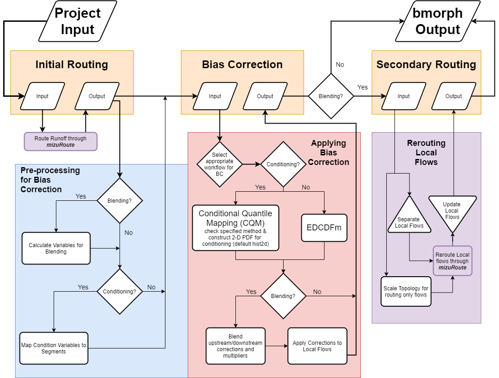

Bias Correction
===============

This page describes the implementation of bmorph bias correction for streamflow.

bmorph Functionality
--------------------

The figure above shows the full workflow and options available in bmorph. The input, in the upper left, shows that bmorph takes in routed streamflows.
Then, if necessary, we perform some pre-processing steps as implemented in the `bmorph.utils.mizuroute_utils.to_bmorph <https://bmorph.readthedocs.io/en/develop/api.html#bmorph.util.mizuroute_utils.to_bmorph>`_ function.
These preprocessing steps are necessary if either spatially consistent bias correction (through blending) and/or process-aware bias correction (through conditioning) are selected.
Following the pre-processing steps bias correction is performed according to the selected options.
If spatially consistent bias correction is performed the bias corrected local flows are then rerouted through mizuRoute.

PresRat and EDCDFm
------------------
The basic underlying bias correction technique that bmorph implements is the PresRat bias correction from Pierce et al. (2015), which is an extension of Equidistant quantile matching (EDCDFm) technique of Li et al. (2010).
bmorph uses the amended EDCDFm to compute multiplicative changes in the quantiles of a Cumulative Distribution Function (CDF).
bmorph also modifies these underlying techniques by taking a rolling window over successive bias correction intervals, which eliminates statistical artifacts at the edges of these intervals.

Conditional Quantile Mapping (CQM)
----------------------------------
Conditional Quantile Mapping, (CQM), incorporates meteorologic data into the ``bmorph`` bias correction process to condition flow time series to other hydrologically relevant information. By creating a series of CDFs based on meteorologic data, (such as minimum daily temperature), ``bmorph`` can select a CDF that will not only correct the time series, but most closely match the meteorologic conditions simulated.

.. image:: Figures/conditioning_diagram_with_arrows.png
    :alt: Multidimensional CDF functions are shown has heat maps with raw taking up left and reference taking up center. A cumulative probability plot compares raw model CDF and Reference flow CDF for one meteorologic slice of the heatmaps left of it. Arrows demonstrate mapping the reference data in the heat maps to the raw model data for bias correction.

.. math::

    \tilde{x}_{mp} = x_{mp} + F^{-1}_{oc}(F_{mp}(x_{mp}|y_{mp})|y_{oc})
                            - F^{-1}_{mc}(F_{mp}(x_{mp}|y_{mp})|y_{mc})

Spatially Consistent Bias correction (SCBC)
-------------------------------------------
To address the artifacts that traditional bias correction techniques can introduce into distributed streamflow predictions we have developed a regionalization technique which blends the target distribution between reference flow sites.
This makes use of the topology of the river network by selecting target distributions which are nearby and interpolating between them as a function of distance.
A schematic representation of this blending is shown below.

There are two edge cases which require special handling. In the case where there are no gauge sites to select either up or down stream we choose the reference site according to some user-definable criteria.
There are a few different options for doing this: leaving the sites empty (``leave_null``), using xarray's `forward_fill <http://xarray.pydata.org/en/stable/generated/xarray.DataArray.ffill.html>`_, or selecting based on some measure of similarity (``r2``, ``kldiv``, ``kge``).
When a site has multiple upstream gauge sites as tributaries we simply choose the closest.
When we make use of this blended bias correction we do not simply bias correct total flows to produce bias corrected total flows, but rather use the ratio of the bias corrected total flow to the raw total flow to develop a correction factor which is then applied to the local (incremental) flow along each river reach in the network.
These corrected local flows are then re-routed through mizuRoute to produce a spatially-consistent bias-corrected streamflow, thus we refer to this method as SCBC.

.. image:: Figures/Blending_Diagram.png
    :alt: In blending, attributes from one gauge site are mixed with another gauge site depending on how close the intermediate seg is to each gauge site, (depicted left by 5 circles translating from pink to purple to blue across the segs). As a result, intermediate CDFs can be produced by transitioning from one gauge site CDF to another, (depicted right by pink CDF curves transforming into purple then blue CDFs curves).

The blend factor describes how upstream and downstream flows should be interpolated, or "blended" together. It is used in the following way,

| Let ...
|    UM, DM = Upstream Measure, Downstream Measure (length, r2, Kullback-Leibler Divergence, or Kling-Gupta Efficiency)
|    BF = Blend Factor
|    UF, DF, TF = Upstream Corrected Flow, Downstream Corrected Flow, Total Corrected Flow

.. math::

    BF = \frac{UM}{UM+DM}
    TF = (BF*UF) + ((1-BF)*DF)

Selecting bias correction techniques
------------------------------------
Below we show how to implement and combine the the various options described above.

Independent Bias Correction: Univariate (IBC_U)
^^^^^^^^^^^^^^^^^^^^^^^^^^^^^^^^^^^^^^^^^^^^^^^

Univariate Independent Bias Correction (IBC_U) is considered the traditional bias correction method implemented here as described in the EDCDFm section above. This method can only be performed at sites with reference data, which is useful when gauge sites can measure flows but does not guarantee spatially consistent corrections amongst a series of gauge sites.

Workflow function : `bmorph.core.workflows.apply_bmorph`_

.. code:: ipython3

    raw_ts = basin_met_seg.sel(seg=seg)['IRFroutedRunoff'].to_series()
    train_ts = basin_met_seg.sel(seg=seg)['IRFroutedRunoff'].to_series()
    obs_ts = basin_met_seg.sel(seg=seg)['up_ref_flow'].to_series()

    ibc_u_flows[site], ibc_u_mults[site] = bmorph.workflows.apply_interval_bmorph(
        raw_ts, train_ts, obs_ts,
        apply_window, train_window, reference_window,
        interval=interval, overlap=overlap)

Independent Bias Correction: Conditioned (IBC_C)
^^^^^^^^^^^^^^^^^^^^^^^^^^^^^^^^^^^^^^^^^^^^^^^^

Similar to `IBC_U <https://bmorph.readthedocs.io/en/develop/bias_correction.html#independent-bias-correction-univariate-ibc-u>`_, Conditioned Independent Bias Correction (IBC_C) can only apply corrections at gauge sites where there is reference flow data. IBC_C integrates meteorologic data into the ``bmorph`` bias correction process as described in `bmorph.core.bmorph.cqm <https://bmorph.readthedocs.io/en/develop/api.html#bmorph.core.bmorph.cqm>`_. Conditioning allows hydrologic process based knowledge to be included in the bias correction process that can help to root bias corrections in meteorologic trends.

Workflow function : `bmorph.core.workflows.apply_bmorph`_

.. code:: ipython3

    raw_ts = basin_met_seg.sel(seg=seg)['IRFroutedRunoff'].to_series()
    train_ts = basin_met_seg.sel(seg=seg)['IRFroutedRunoff'].to_series()
    ref_ts = basin_met_seg.sel(seg=seg)['up_ref_flow'].to_series()
    cond_var = basin_met_seg.sel(seg=seg)[f'up_{condition_var}'].to_series()

    ibc_c_flows[site], ibc_c_mults[site] = bmorph.workflows.apply_bmorph(
        raw_ts, train_ts, ref_ts,
        apply_window, train_window, reference_window,
        condition_ts=cond_var,
        interval=interval, overlap=overlap)

Notice that in order to use conditioning, the ``*_y`` variables are needed to specify which meteorological time series to use in conditioning.

Spatially Consistent Bias Correction: Univariate (SCBC_U)
^^^^^^^^^^^^^^^^^^^^^^^^^^^^^^^^^^^^^^^^^^^^^^^^^^^^^^^^^

Univariate Spatially Consistent Bias Correction (SCBC_U) aims to address IBC's inability to correct flows at non-gauge sites where reference timeseries do not exist. Spatial consistency is conserved by performing bias corrections at every river segment, or `seg <https://bmorph.readthedocs.io/en/develop/data.html#variable-naming-conventions>`_, and then rerouting the corrected flows through `mizuRoute <https://mizuroute.readthedocs.io/en/latest/>`_. Reference data for each seg that is not a gauge site is done by creating proxy reference data for each seg from upstream and downstream proxy gauge flows that can be combined, or blended, together to create what the reference flow data for that seg should look like, as described in `Spatial Consistency: Reference Site Selection & CDF Blend Factor <https://bmorph.readthedocs.io/en/develop/bias_correction.html#spatial-consistency-reference-site-selection-cdf-blend-factor>`_.

Workflow functions : `bmorph.core.workflows.apply_blendmorph`_, `bmorph.core.workflows.run_parallel_scbc`_

.. code:: ipython3

    univariate_config = {
    'train_window': train_window,
    'apply_window': apply_window,
    'reference_window': reference_window,
    'interval': interval,
    'overlap': overlap,
    }

    unconditioned_seg_totals = bmorph.workflows.run_parallel_scbc(
    basin_met_seg, client, output_prefix, mizuroute_exe, univariate_config)

Spatially Consistent Bias Correction: Conditioned (SCBC_C)
^^^^^^^^^^^^^^^^^^^^^^^^^^^^^^^^^^^^^^^^^^^^^^^^^^^^^^^^^^

Conditioned Spatially Consistent Bias Correction (SCBC_C) combines the meteorologic conditioning elements of `IBC_C <https://bmorph.readthedocs.io/en/develop/bias_correction.html#independent-bias-correction-conditioned-ibc-c>`_ with the spatial consistency of `SCBC_U <https://bmorph.readthedocs.io/en/develop/bias_correction.html#spatially-consistent-bias-correction-univariate-scbc-u>`_. This implementation of SCBC factors in meteorologic variables given into the formulation of reference flows for each seg to be corrected to. Defined by the hydrologic response units, or `hru's <https://bmorph.readthedocs.io/en/develop/data.html#variable-naming-conventions>`_, they impact, meteorologic data is mappable to each seg within the watershed topology. In `IBC_C <https://bmorph.readthedocs.io/en/develop/bias_correction.html#independent-bias-correction-conditioned-ibc-c>`_, only the data mapped to gauge sites would be used in bias correction, whereas SCBC_C can utilize meteorologic data across the watershed as it incorporates all defined segs.

Workflow functions : `bmorph.core.workflows.apply_blendmorph`_, `bmorph.core.workflows.run_parallel_scbc`_

.. code:: ipython3

    conditonal_config = {
    'train_window': train_window,
    'apply_window': apply_window,
    'reference_window': reference_window,
    'interval': interval,
    'overlap': overlap,
    'condition_var': condition_var
    }

    conditioned_seg_totals = bmorph.workflows.run_parallel_scbc(
    basin_met_seg, client, output_prefix, mizuroute_exe, conditonal_config)

Again, because we are conditioning our bias corrections, ``condition_var`` must be included in running this script.

.. _`bmorph.core.workflows.apply_annual_bmorph`: https://bmorph.readthedocs.io/en/develop/api.html#bmorph.core.workflows.apply_annual_bmorph
.. _`bmorph.core.workflows.apply_interval_bmorph`: https://bmorph.readthedocs.io/en/develop/api.html#bmorph.core.workflows.apply_interval_bmorph`
.. _`bmorph.core.workflows.apply_annual_blendmorph`: https://bmorph.readthedocs.io/en/develop/api.html#bmorph.core.workflows.apply_annual_blendmorph
.. _`bmorph.core.workflows.apply_interval_blendmorph`: https://bmorph.readthedocs.io/en/develop/api.html#bmorph.core.workflows.apply_interval_blendmorph

Citations
---------

Pierce, D. W., Cayan, D. R., Mauerer, E. P., Abatzoglou J. T., & Hegewisch, K. C. (2015). Improved Bias Correction Techniques for Hydrological Simulations of Climate Change. *Journal of Hydrometeorology, 16*(6), 2421-2442. `http://dx.doi.org/10.1175/JHM-D-14-0236.1 <http://dx.doi.org/10.1175/JHM-D-14-0236.1>`_

Li, H., Sheffield, J.,  & Wood, E. F. (2010). Bias correction of monthly precipitation and temperature fields from Intergovernmental Panel on Climate Change AR4 models using equidistant quantile matching. *Journal of Geophysical Research: Atmospheres, 115*(D10), 1-20. `https://doi.org/10.1029/2009JD012882 <https://doi.org/10.1029/2009JD012882>`_
