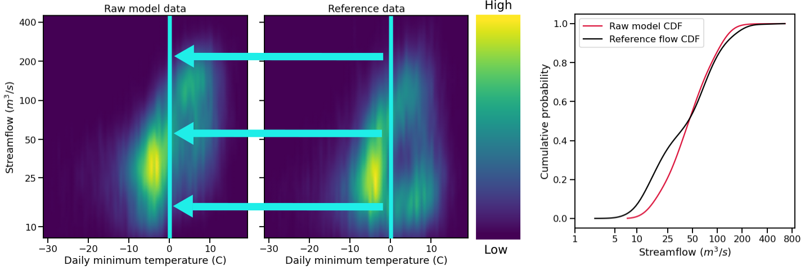

Bias Correction
===============

This page documents the implementation of
**bmorph** bias correction for streamflow
data in a watershed. An example workflow notebook
can be found in ``bmorph_tutorial``.

bmorph Functionality
--------------------

Conditioning: EDCDFm vs Conditional Quantile Mapping (CQM)
^^^^^^^^^^^^^^^^^^^^^^^^^^^^^^^^^^^^^^^^^^^^^^^^^^^^^^^^^^

EDCDFm
""""""

Before describing how conditioning is integrated into ``bmorph`` bias correction, we need to discuss the standard method. 
``bmorph`` implements part of PresRat bias correction from Pierce et al. (2015), which is an extension of Equidistant quantile matching (EDCDFm) technique of Li et al. (2010). ``bmorph`` uses the amended EDCDFm to compute multiplicative changes in the quantiles of a Cumulative Distribution Fuction (CDF). Here, only flow values are used to construct the CDFs. 

[need image here comparing bias correction methods]

Conditional Quantile Mapping (CQM)
""""""""""""""""""""""""""""""""""

Conditional Quantile Mapping, (CQM), incorporates meteorologic data into the ``bmorph`` bias correction process to condition flow time series to other hydrologically relevant information. By creating a series of CDFs based on meteorologic data, (such as minimum daily temperature), ``bmorph`` can select a CDF that will not only correct the time series, but most closely match the metrologic conditions simulated.
    
ate mapping the reference data in the heat maps to the raw model data for bias correction.

.. math::

    \tilde{x_{mp}} = x_{mp} + F^{-1}_{oc}(F_{mp}(x_{mp}|y_{mp})|y_{oc})
                            - F^{-1}_{mc}(F_{mp}(x_{mp}|y_{mp})|y_{mc})
                            
Spatial Consistency: Reference Site Selection & CDF Blend Factor
^^^^^^^^^^^^^^^^^^^^^^^^^^^^^^^^^^^^^^^^^^^^^^^^^^^^^^^^^^^^^^^^

Spatial consistency is conserved by combining streamflows that are ``bmorph`` bias corrected with respect to upstream and downstream reprentative sites. Ideally, if a seg has a gauge site directly upstream and downstream of it, then a reference for that seg can be interpolated as a combination of those two gauge sites. Now because there are not gauge sites everywhere, (which would render this method unncessary), the gauge sites used as the upstream/downstream need to be selected, this is where ``fill_method`` comes into play in `bmorph.utils.mizuroute_utils.mizuroute_to_blendmorph <https://bmorph.readthedocs.io/en/develop/api.html#bmorph.util.mizuroute_utils.mizuroute_to_blendmorph>`. Segs that are gauge sites are simply assigned themselves as their upstream/downstream segments. Looking downstream can typically yeild a gauge site as rivers do not typically branch out in the direction of flow. Looking upstream for a 
gauge site gets more complicated as a one:many relationship occurs. Hence, needing to "fill" in gauge sites that are not simply found. There are a few different means of doing this: leaving the sites empty (``leave_null``), using xarray's `forward_fill <http://xarray.pydata.org/en/stable/generated/xarray.DataArray.ffill.html>`_, or selecting based on different statistical measures of simularity (``r2``, ``kldiv``, ``kge``). 

e CDFs can be produced by transitioning from one gauge site CDF to another, (depicted right by pink CDF curves transforming into purple then blue CDFs curves).

Blend factor describes how upstream and downstream flows should be combined, or "blended" together.
Let

|    UM, DM = Upstream Measure, Downstream Measure (length, r2, Kullback-Leibler Divergence, or Kling-Gupta Efficiency)    
|    BF = Blend Factor    
|    UF, DF, TF = Upstream Corrected Flow, Downstream Corrected Flow, Total Corrected Flow    

.. math:: 

    BF = \frac{UM}{UM+DM}
    TF = (BF*UF) + ((1-BF)*DF)

Independent Bias Correction: Univariate (IBC_U)
^^^^^^^^^^^^^^^^^^^^^^^^^^^^^^^^^^^^^^^^^^^^^^^

Univariated Independent Bias Correction (IBC_U) is considered the traditional bias correction method implemented here as described in `EDCDFm`_. This method can only be performed at sites with refernce data, which is useful when gauge sites can measure flows but does not gaurentee spatially consitent corrections amongst a series of gauge sites. None the less, it performs best out of all four methods at the gauge sites where it can correct, but may introduce spatial incongruties across sites.

Workflow functions : `bmorph.core.workflows.apply_annual_bmorph`_, `bmorph.core.workflows.apply_interval_bmorph`_

Independent Bias Correction: Conditioned (IBC_C)
^^^^^^^^^^^^^^^^^^^^^^^^^^^^^^^^^^^^^^^^^^^^^^^^

Similar to `IBC_U <Independent Bias Correction: Univariate (IBC_U)>`_, Conditioned Independent Bias Correction (IBC_C) can only apply corrections at gauge sites where there is refence flow data. IBC_C integrates meteorologic data into the ``bmorph`` bias correction process as described in `bmorph.core.bmorph.cqm <https://bmorph.readthedocs.io/en/develop/api.html#module-bmorph.core.bmorph.cqm>`_. Conditioning allows hydrologic process based knowledge to be included in the bias correction process that can help to root bias corrections in meteorologic trends. 

Workflow functions : `bmorph.core.workflows.apply_annual_bmorph`_, `bmorph.core.workflows.apply_interval_bmorph`_

Spatially Consistent Bias Correction: Univariate (SCBC_U)
^^^^^^^^^^^^^^^^^^^^^^^^^^^^^^^^^^^^^^^^^^^^^^^^^^^^^^^^^

Univariate Spatially Consistent Bias Correction (SCBC_U) aims to address IBC's inability to correct flows at non-gauge sites where reference timeseries do not exist. Spatial consistency is conserved by performing bias corrrections at every river segement, or `seg <data.rst/Common Naming Conventions>`_, and then rerouting the corrected flows through `mizuroute <https://mizuroute.readthedocs.io/en/latest/>`_. Reference data for each seg that is not a gauge site is done by creating proxy reference data for each seg from upstream and downstream proxy gauge flows that can be combinded, or blended, together to create what the reference flow data for that seg should look like, as described in `Spatial Conistency: Reference Site Selection & CDF Blend Factor <data.rst/Spatial Consistency: Reference Site Selection & CDF Blend Factor>`_. 

Workflow functions : `bmorph.core.workflows.apply_annual_blendmorph`_, `bmorph.core.workflows.apply_interval_blendmorph`_

Spatially Consistent Bias Correction: Conditioned (SCBC_C)
^^^^^^^^^^^^^^^^^^^^^^^^^^^^^^^^^^^^^^^^^^^^^^^^^^^^^^^^^^

Conditioned Spatially Consistent Bias Correction (SCBC_C) combines the meteorologic conditioning elements of `IBC_C <Independent Bias Correction: Conditioned (IBC_C)>`_ with the spatial consistency of `SCBC_U <Spatially Consistent Bias Correction: Univariate (SCBC_U)>`_. This implementation of SCBC factors in meteorologic variables given into the formulation of refernce flows for each seg to be corrected to. Defined by the hydrologic response units, or `hru's <data.rst/Common Naming Conventions>`_, they impact, meteorologic data is mappable to each seg within the watershed topology. In `IBC_C <Independent Bias Correction: Conditioned (IBC_C)>`_, only the data mapped to gauge sites would be used in bias correction, whereas SCBC_C can utilize meteorologic data across the watershed as it incoporates all defined segs. 

Workflow functions : `bmorph.core.workflows.apply_annual_blendmorph`_, `bmorph.core.workflows.apply_interval_blendmorph`_

.. _`bmorph.core.workflows.apply_annual_bmorph`: https://bmorph.readthedocs.io/en/develop/api.html#module-bmorph.core.workflows.apply_annual_bmorph
.. _`bmorph.core.workflows.apply_interval_bmorph`: https://bmorph.readthedocs.io/en/develop/api.html#module-bmorph.core.workflows.apply_interval_bmorph`
.. _`bmorph.core.workflows.apply_annual_blendmorph`: https://bmorph.readthedocs.io/en/develop/api.html#module-bmorph.core.workflows.apply_annual_blendmorph
.. _`bmorph.core.workflows.apply_interval_blendmorph`: https://bmorph.readthedocs.io/en/develop/api.html#module-bmorph.core.workflows.apply_interval_blendmorph
                            
Citations
---------

Pierce, D. W., Cayan, D. R., Mauerer, E. P., Abatzoglou J. T., & Hegewisch, K. C. (2015). Improved Bias Correction Techniques for Hydrological Simulations of Climate Change. *Journal of Hydrometeorology, 16*(6), 2421-2442. http://dx.doi.org/10.1175/JHM-D-14-0236.1_

Li, H., Sheffield, J.,  & Wood, E. F. (2010). Bias correction of monthly precipitation and temperature fields from Intergovernmental Panel on Climate Change AR4 models using equidistant quantile matching. *Journal of Geophysical Research: Atmospheres, 115*(D10), 1-20. https://doi.org/10.1029/2009JD012882_
