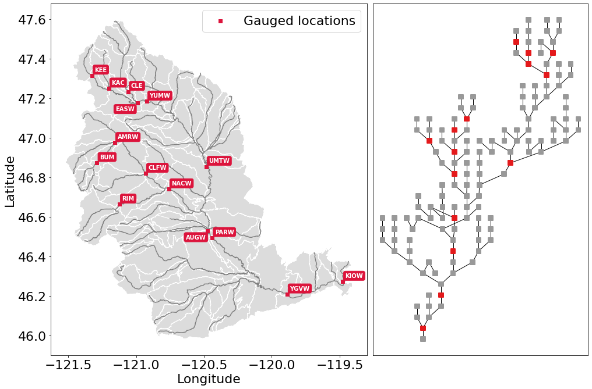
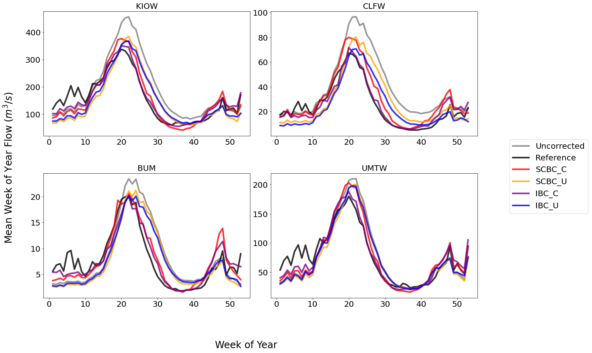
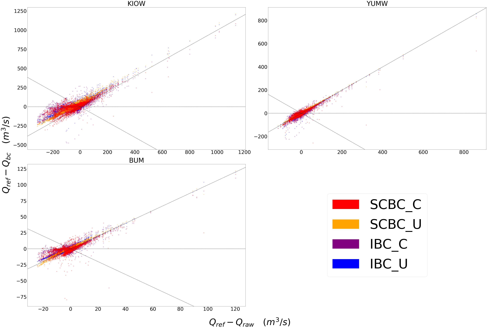
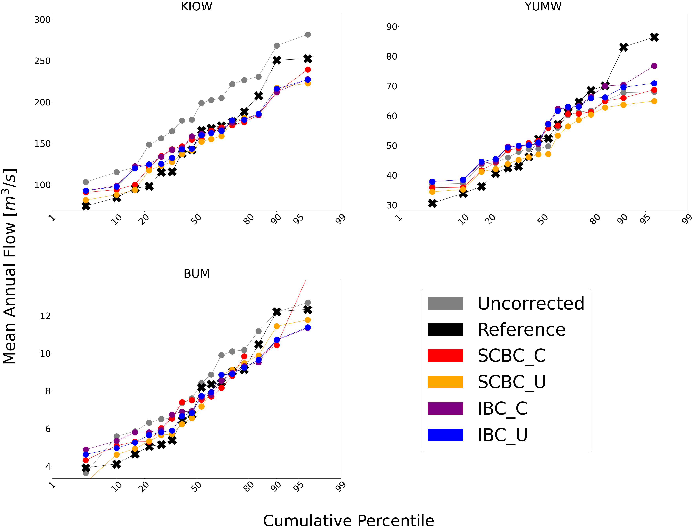
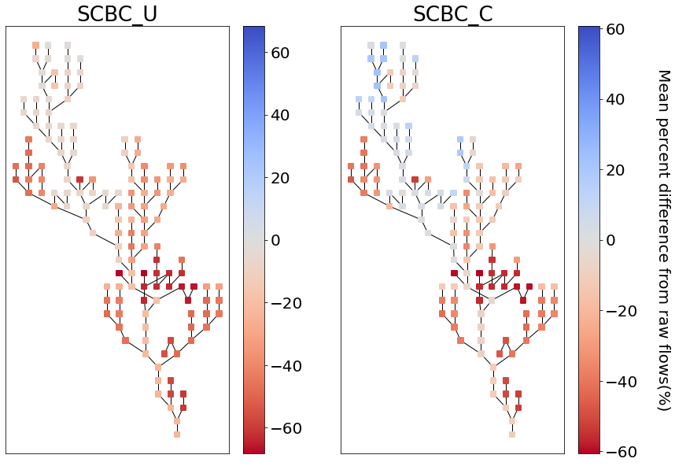

bmorph Tutorial: Getting your first bias corrections
====================================================

This notebook demonstrates how to setup data for and bias correct it
through bmorph, it contains the same information as the
`tutorial <bmorph_tutorial.rst>`__ page. In this notebook, we will
demonstrate how to perform four variations of bias correction. For more
information about the details of each method refer to the `bias
correction
page <https://bmorph.readthedocs.io/en/latest/bias_correction.html>`__
page. The rest of the documentation for bmorph can be found
`here <https://bmorph.readthedocs.io/en/latest/index.html>`__.

-  Independent Bias Correction: Univariate (IBC_U) : IBC_U is the
   traditional bias correction method. This method can only be performed
   at sites with reference data.
-  Independent Bias Correction: Conditioned (IBC_C) : IBC_C allows for
   correcting for specific biases that are process-dependent. This
   method can only be performed at sites with reference data.
-  Spatially Consistent Bias Correction: Univariate (SCBC_U): SCBC_U
   corrects local flows at each river reach in the network, and then 
   reroutes them to aggregate, producing bias corrected flows at 
   locations of interest where reference data does and does not exist.
-  Spatially Consistent Bias Correction: Conditioned (SCBC_C): SCBC_C
   also corrects the local flows like SCBC_U, but allows for
   conditioning on dependent processes.

Expectations using this Tutorial
================================

Before we begin, we are expecting that anyone using this notebook is
already familiar with the following:

-  Python 3 syntax and logic
-  `Jupyter
   Notebooks <https://jupyterlab.readthedocs.io/en/stable/user/notebook.html>`__
-  `numpy <https://numpy.org/>`__
-  `pandas <https://pandas.pydata.org/>`__
-  `xarray <http://xarray.pydata.org/en/stable/>`__
-  `matplotlib <https://matplotlib.org/>`__
-  `mizuRoute <https://mizuroute.readthedocs.io/en/latest/>`__

This tutorial also makes use of a number of other open source libraries
& programs which, although no familiarity is required, may be of
interest: - `geopandas <https://geopandas.org/>`__ -
`tqdm <https://tqdm.github.io/>`__ - `dask <https://dask.org/>`__ -
`networkx <https://networkx.org/>`__ -
`scipy <https://www.scipy.org/>`__ -
`scikit-learn <https://scikit-learn.org/stable/>`__

While proficiency with each item is not required to understand the
notebook, the details of these items will not be included in the
tutorial itself.

Learning objectives & goals
===========================

By the end of this tutorial you will learn

-  The data requirements to perform streamflow bias corrections with bmorph
-  Input and output formats that bmorph expects
-  The meaning of parameters for algorithmic control of bias corrections
-  How to perform independent bias correction at locations with
   reference flows
-  How to perform spatially consistent bias corrections across a river
   network, as well as rerouting the corrected flows with mizuRoute
-  How to use the analysis, evaluation, and visualization tools built
   into bmorph

We expect that this tutorial will take approximately half an hour for
someone familiar with Python.

Import Packages and Load Data
=============================

We start by importing the necessary packages for the notebook. This
tutorial mainly shows how to use ``bmorph.core.workflows`` and
``bmorph.core.mizuroute_utils`` to bias correct streamflow data in the
Yakima River Basin.

.. code:: ipython3

    %pylab inline
    %load_ext autoreload
    %autoreload 2
    %reload_ext autoreload

    import warnings
    warnings.filterwarnings('ignore')
    import os
    import sys
    import numpy as np
    import xarray as xr
    import pandas as pd
    import geopandas as gpd
    import matplotlib as mpl
    import matplotlib.pyplot as plt
    from tqdm.notebook import tqdm
    from dask.distributed import Client, progress

    # Set a bigger default plot size
    mpl.rcParams['figure.figsize'] = (10, 8)
    mpl.rcParams['font.size'] = 22

    # Import bmorph, and mizuroute utilities
    import bmorph
    from bmorph.util import mizuroute_utils as mizutil
    from bmorph.evaluation.simple_river_network import SimpleRiverNetwork
    from bmorph.evaluation import plotting as bplot

    # Set the environment directory, this is a workaround for portability
    envdir = os.path.dirname(sys.executable)

    # Import pyproj and set the data directory, this is a workaround for portability
    import pyproj
    pyproj.datadir.set_data_dir(f'{envdir}/../share/proj')

.. parsed-literal::

    Populating the interactive namespace from numpy and matplotlib

Getting the sample data
-----------------------

The following code cell has two commands preceded by ``!``, which
indicates that they are shell commands. They will download the sample
data and unpackage it. The sample data can be viewed as a HydroShare
resource
`here <https://www.hydroshare.org/resource/fd2a347d34f145b4bfa8b6bff39c782b/>`__.
This cell may take a few moments.

.. code:: ipython3

    ! wget https://www.hydroshare.org/resource/fd2a347d34f145b4bfa8b6bff39c782b/data/contents/bmorph_testdata.tar.gz
    ! tar xvf bmorph_testdata.tar.gz

.. parsed-literal::

    --2021-07-02 12:20:36--  https://www.hydroshare.org/resource/fd2a347d34f145b4bfa8b6bff39c782b/data/contents/bmorph_testdata.tar.gz
    Resolving www.hydroshare.org (www.hydroshare.org)... 152.54.2.89
    Connecting to www.hydroshare.org (www.hydroshare.org)|152.54.2.89|:443... connected.
    HTTP request sent, awaiting response... 301 Moved Permanently
    Location: /resource/fd2a347d34f145b4bfa8b6bff39c782b/data/contents/bmorph_testdata.tar.gz/ [following]
    --2021-07-02 12:20:37--  https://www.hydroshare.org/resource/fd2a347d34f145b4bfa8b6bff39c782b/data/contents/bmorph_testdata.tar.gz/
    Reusing existing connection to www.hydroshare.org:443.
    HTTP request sent, awaiting response... 500 Internal Server Error
    2021-07-02 12:20:37 ERROR 500: Internal Server Error.

    yakima_workflow/
    yakima_workflow/mizuroute_configs/
    yakima_workflow/mizuroute_configs/.ipynb_checkpoints/
    yakima_workflow/mizuroute_configs/.ipynb_checkpoints/reroute_deschutes_univariate-checkpoint.control
    yakima_workflow/mizuroute_configs/.ipynb_checkpoints/reroute_deschutes_conditional-checkpoint.control
    yakima_workflow/mizuroute_configs/__init__.py
    yakima_workflow/input/
    yakima_workflow/input/nrni_reference_flows.nc
    yakima_workflow/input/yakima_raw_flows.nc
    yakima_workflow/input/yakima_met.nc
    yakima_workflow/output/
    yakima_workflow/output/__init__.py
    yakima_workflow/.ipynb_checkpoints/
    yakima_workflow/topologies/
    yakima_workflow/topologies/.ipynb_checkpoints/
    yakima_workflow/topologies/.ipynb_checkpoints/param.nml-checkpoint.default
    yakima_workflow/topologies/param.nml.default
    yakima_workflow/topologies/yakima_huc12_topology.nc
    yakima_workflow/topologies/yakima_huc12_topology_scaled_area.nc
    yakima_workflow/gis_data/
    yakima_workflow/gis_data/crcc_pointlist.txt
    yakima_workflow/gis_data/yakima_hru.shp
    yakima_workflow/gis_data/yakima_seg.prj
    yakima_workflow/gis_data/yakima_seg.cpg
    yakima_workflow/gis_data/yakima_hru.dbf
    yakima_workflow/gis_data/yakima_seg.shx
    yakima_workflow/gis_data/yakima_seg.shp
    yakima_workflow/gis_data/yakima_seg.dbf
    yakima_workflow/gis_data/yakima_hru.cpg
    yakima_workflow/gis_data/yakima_hru.prj
    yakima_workflow/gis_data/yakima_hru.shx
    yakima_workflow/README.md

Test dataset: The Yakima River Basin
====================================

Before getting into how to run bmorph, let's look at what is in the 
sample data. You will note that we now have a ``yakima_workflow`` 
directory downloaded in the same directory as this notebook (found by 
clicking on the ``1tutorial/`` tab left by Binder or navigating to 
this directory in the file explorer of your choice). This contains 
all of the data that you need to run the tutorial. There are a few 
subdirectories:

-  ``gis_data``: contains shapefiles, this is mainly used for plotting,
   not for analysis
-  ``input``: this is the input meteorologic data, simulated streamflow
   to be corrected, and the reference flow dataset
-  ``mizuroute_configs``: this is an empty directory that will
   automatically be populated with mizuroute configuration files during
   the bias correction process
-  ``output``: this is an empty directory that will be where the bias
   corrected flows will be written out to
-  ``topologies``: this contains the stream network topologies that will
   be used for routing flows via mizuroute

The Yakima River Basin is a tributary of the Columbia river basin in the
Pacific northwestern United States. It’s western half is situated in the
Cascade mountains and receives seasonal snowpack. The eastern half is
lower elevation and is semi-arid. Let’s load up the shapefiles for the
sub-basins and stream network and plot it. In this discretization we
have 285 sub-basins (HRU) and 143 stream segments.

Setting up some metadata
========================

Next we set up the gauge site names and their respective river segment
identification numbers, or ``site``\ ’s and ``seg``\ ’s. This will be
used throughout to ensure the data does not get mismatched. bmorph uses
the convention:
``site_to_seg = { site_0_name : site_0_seg, ..., site_n_name, site_n_seg}``
Since it is convenient to be able to access this data in different
orders we also set up some other useful forms of these gauge site
mappings for later use. We will show you on the map where each of these
sites are on the stream network in the next section.

.. code:: ipython3

    site_to_seg = {'KEE' : 4175, 'KAC' : 4171, 'EASW': 4170,
                   'CLE' : 4164, 'YUMW': 4162, 'BUM' : 5231,
                   'AMRW': 5228, 'CLFW': 5224, 'RIM' : 5240,
                   'NACW': 5222, 'UMTW': 4139, 'AUGW': 594,
                   'PARW': 588,  'YGVW': 584,  'KIOW': 581}

    seg_to_site = {seg: site for site, seg in site_to_seg.items()}
    ref_sites = list(site_to_seg.keys())
    ref_segs = list(site_to_seg.values())

Mapping the Yakima River Basin
==============================

With our necessary metadata defined let’s make a couple of quick plots
orienting you to the Yakima River Basin. To do so we will read in a
network topology file, and shapefiles for the region. We will make one
plot which has the Yakima River Basin, along with stream network,
subbasins, and gauged sites labeled. We will also plot a network diagram
which displays in an abstract sense how each stream segment is
connected. For the latter we use the
`SimpleRiverNetwork <https://bmorph.readthedocs.io/en/latest/srn.html>`__
that we’ve implemented in bmorph. To set up the ``SimpleRiverNetwork``
we need the topology of the watershed (``yakima_topo``). The river 
network and shapefiles that we use to draw the map, and perform 
simulations on is the `Geospatial Fabric <https://doi.org/10.5066/P971JAGF>`__. 
In the Geospatial Fabric, rivers and streams are broken into 
segments, each with a unique identifier, as illustrated above in the 
``site_to_seg`` definition. The locations of the gauged sites are 
shown in red, while all of the un-gauged stream segments are shown in 
darker grey. The sub-basins for each stream segment are shown in 
lighter grey.

.. code:: ipython3

    yakima_topo = xr.open_dataset('yakima_workflow/topologies/yakima_huc12_topology.nc').load()
    yakima_hru = gpd.read_file('./yakima_workflow/gis_data/yakima_hru.shp').to_crs("EPSG:4326")
    yakima_seg = gpd.read_file('./yakima_workflow/gis_data/yakima_seg.shp').to_crs("EPSG:4326")

    fig, axes = plt.subplots(1, 2, figsize=(14, 9), gridspec_kw={'width_ratios': [1.5, 1]})
    axes[1].invert_xaxis() # flip makes nodes line up better with map

    # Plot the subbasins and stream segments
    ax = yakima_hru.plot(color='gainsboro', edgecolor='white', ax=axes[0])
    yakima_seg.plot(ax=ax, color='grey')

    # Plot the reference flow sites
    ref_lats = yakima_seg[yakima_seg['seg_id'].isin(ref_segs)]['end_lat']
    ref_lons = yakima_seg[yakima_seg['seg_id'].isin(ref_segs)]['end_lon']
    ref_names = [seg_to_site[s] for s in yakima_seg[yakima_seg['seg_id'].isin(ref_segs)]['seg_id']]
    ax.scatter(ref_lons, ref_lats, color='crimson', zorder=100, marker='s', label='Gauged locations')
    for name, lat, lon in zip(ref_names, ref_lats, ref_lons):
        if name in ['AUGW', 'EASW']:
            # Set labels at a slightly different position so we don't have overlaps
            offset_x, offset_y = -0.16, -0.04
        else:
            offset_x, offset_y = 0.02, 0.02
        ax.text(lon+offset_x, lat+offset_y, name, fontsize=10, color='white', weight='bold',
                bbox=dict(boxstyle="round", ec='crimson', fc='crimson', ),)
    ax.legend()
    ax.set_xlabel('Longitude')
    ax.set_ylabel('Latitude')

    # Now plot the abstracted river network, with gauged sites highlighted
    yakima_srn = SimpleRiverNetwork(yakima_topo)
    yakima_srn.draw_network(color_measure=yakima_srn.generate_node_highlight_map(ref_segs),
                            cmap=mpl.cm.get_cmap('Set1_r'), ax=axes[1], node_size=60)
    plt.tight_layout(pad=0)

Loading in the streamflow data and associated meteorological data
=================================================================

Now we load in the meteorological data that will be used for conditional
bias correction: daily minimum temperature (``tmin``), seasonal
precipitation (``prec``), and daily maximum temperature (``tmax``). 
In principle, any type of data can be used for conditioning, (i.e. 
Snow-Water Equivalent (SWE), groundwater storage, landscape slope 
angle, etc.). This data is initially arranged on the sub-basins, 
rather than stream segments. We will remap these onto the stream 
segments in a moment, so that they can be used in the bias correction 
process.

Finally, we load the simulated flows and reference flows. bmorph is
designed to bias correct streamflow simulated with
`mizuroute <https://mizuroute.readthedocs.io/en/latest/>`__. We denote
the simulated flows as the “raw” flows when they are uncorrected, and
the flows that will be used to correct the raw flows as the “reference”
flows. During the bias correction process bmorph will map the raw flow
values to the reference flow values by matching their quantiles. In our
case the reference flows are estimated no-reservoir-no-irrigation (NRNI)
flows taken from the `River Management Joint Operating Committee
(RMJOC) <https://www.bpa.gov/p/Generation/Hydro/Documents/RMJOC-II_Part_II.PDF>`__.

All of the datasets discussed are in the ``xarray`` `Dataset
format <http://xarray.pydata.org/en/stable/user-guide/data-structures.html#dataset>`__,
which contains the metadata associated with the original NetCDF files.
You can inspect the data simply by printing it out. For instance, here
you can see that both the reference flows and raw flows (named
``IRFroutedRunoff``, for “Impulse Response Function routed runoff” from
mizuRoute) are in cubic meters per second.

.. code:: ipython3

    # Meteorologic data
    yakima_met = xr.open_dataset('yakima_workflow/input/yakima_met.nc').load()
    # Remove the 17* prefix, which was used to denote the domain covers the region 17 of the Hydrologic Unit Maps
    yakima_met['hru'] = (yakima_met['hru'] - 1.7e7).astype(np.int32)

    # Raw streamflows
    yakima_raw = xr.open_dataset('yakima_workflow/input/yakima_raw_flows.nc')[['IRFroutedRunoff', 'dlayRunoff', 'reachID']].load()
    # Update some metadata
    yakima_raw['seg'] = yakima_raw.isel(time=0)['reachID'].astype(np.int32)

    # Reference streamflows - this contains sites from the entire Columbia river basin, but we will select out only the `ref_sites`
    yakima_ref = xr.open_dataset('yakima_workflow/input/nrni_reference_flows.nc').rename({'outlet':'site'})[['seg', 'seg_id', 'reference_flow']]
    # Pull out only the sites in the Yakima basin
    yakima_ref = yakima_ref.sel(site=ref_sites).load()

    print('Reference flow units: ', yakima_ref['reference_flow'].units)
    print('Raw flow units: ', yakima_raw['IRFroutedRunoff'].units)

.. parsed-literal::

    Reference flow units:  m3/s
    Raw flow units:  m3/s

Convert from ``mizuroute`` output to ``bmorph`` format
------------------------------------------------------

``mizuroute_utils`` is our utility module that will handle converting
mizuroute outputs to the format that we need for ``bmorph``. We will use
the ``mizutil.to_bmorph`` function to merge together all of the data we
previously loaded, and calculate some extra pieces of information to
perform spatially consistent bias corrections (SCBC). For more
information about how we perform SCBC see `the SCBC page in the
documentation <https://bmorph.readthedocs.io/en/develop/bias_correction.html#spatial-consistency-reference-site-selection-cdf-blend-factor>`__.
Now we pass our data in to ``to_bmorph``, the primary utility function
for automating ``bmorph`` pre-processing.

.. code:: ipython3

    yakima_met_seg = mizutil.to_bmorph(yakima_topo, yakima_raw, yakima_ref, yakima_met,  fill_method='r2')

Setting up ``bmorph`` configuration and parameters
--------------------------------------------------

Before applying bias correction we need to specify some parameters and
configuration for correction. Returning to these steps can help fine
tune your bias corrections to the basin you are analyzing.

The ``train_window`` is what we will use to train the bias correction
model. This is the time range that is representative of the basin’s
expected behavior that ``bmorph`` should mirror.

The ``bmorph_window`` is when ``bmorph`` should be applied to the series
for bias correction.

Lastly the ``reference_window`` is when the reference flows should be
used to smooth the Cumulative Distribution function (CDF) of the bias
corrected flows. This is recommended to be set as equivalent to the
``train_window``.

.. code:: ipython3

    train_window = pd.date_range('1981-01-01', '1990-12-30')[[0, -1]]
    reference_window = train_window
    apply_window= pd.date_range('1991-01-01', '2005-12-30')[[0, -1]]

``interval`` is the length of ``bmorph``\ ‘s application intervals,
typically a factor of years to preserve hydrologic relationships. Note
that for ``pandas.DateOffset``, ’year’ and ‘years’ are different and an
‘s’ should always be included here for ``bmorph`` to run properly, even
for a single year.

``overlap`` describes how many days the bias correction cumulative
distribution function windows should overlap in total with each other.
``overlap`` is evenly distributed before and after this window. This is
used to reduce discontinuities between application periods. Typical
values are between 60 and 120 days.

The two “smoothing” parameters are used to smooth the timeseries before
the CDFs are computed and have two different uses. THe
``n_smooth_short`` is used in the actual calculation of the CDFs which
are used to perform the quantile mapping. Smoothing is used to ensure
that the CDFs are smooth. Setting a very low value here may cause
noisier bias corrected timeseries. Setting a very high value may cause
the bias corrections to not match extreme flows. Typical values are from
7-48 days.

``n_smooth_long`` on the other hand is used to preserve long-term trends
in mean flows from the raw flows. Typical values are 270 to 720 days.
Using very low values may cause bias corrections to be degraded. This
feature can be turned off by setting ``n_smooth_long`` to ``None``.

``condition_var`` names the variable to use in conditioning, such as
maximum temperature (tmax), 90 day rolling total precipitation
(seasonal_precip), or daily minimum temperature (tmin). At this time,
only one conditioning meteorological variable can be used per ``bmorph``
execution. In this example, ``tmax`` and ``seasonal_precip`` have been
commented out to select ``tmin`` as the conditioning variable. If you 
wish to change this, be sure to either change which variables are 
commented out or change the value of ``condition_var`` itself. For 
now we will just use ``tmin``, which is the daily minimum 
temperature. Our hypothesis on choosing ``tmin`` is that it will be a 
good indicator for errors in snow processes, which should provide a 
good demonstration for how conditional bias correction can modify 
flow timing in desirable ways.

Further algorithmic controls can be used to tune the conditional bias
correction as well. Here we use the histogram method for estimating the
joint PDF, which is provided as ``hist`` as the ``method``. We also have
implemented a kernel density estimator which will be used if you set the
``method`` to ``kde``. While ``kde`` tends to make smoother PDFs it
comes with a larger computational cost. For both methods we specify the
number of ``xbins`` and ``ybins`` which control how fine grained the
joint PDFs should be calculated as. Setting a very high number here can
potentially cause jumpy artifacts in the bias corrected timeseries.

.. code:: ipython3

    # bmorph parameter values
    interval = pd.DateOffset(years=5)
    overlap = 90
    n_smooth_long = 365
    n_smooth_short = 21

    # Select from the various available meteorologic fields for conditioning
    #condition_var = 'tmax'
    #condition_var = 'seasonal_precip'
    condition_var = 'tmin'

Here we name some configuration parameters for ``bmorph``\ ’s
conditional and univariate bias correction methods, respectively.

``output_prefix`` will be used to write and load files according to the
basin’s name, make certain to update this with the actual name of the
basin you are analyzing so you can track where different files are
written.

.. code:: ipython3

    conditional_config = {
        'data_path':  './yakima_workflow',
        'output_prefix': "yakima",
        'raw_train_window': train_window,
        'ref_train_window': reference_window,
        'apply_window': apply_window,
        'interval': interval,
        'overlap': overlap,
        'n_smooth_long': n_smooth_long,
        'n_smooth_short': n_smooth_short,
        'condition_var': condition_var,
        'method': 'hist',
        'xbins': 100,
        'ybins': 100,
    }

    univariate_config = {
        'data_path':  './yakima_workflow',
        'output_prefix': "yakima",
        'raw_train_window': train_window,
        'ref_train_window': reference_window,
        'apply_window': apply_window,
        'interval': interval,
        'overlap': overlap,
        'n_smooth_long': n_smooth_long,
        'n_smooth_short': n_smooth_short,
    }

You made it! Now we can actually bias correct with ``bmorph``!

First off we run the Independent Bias Corrections, which are completely
contained in the cell below.

Here we run through each of the gauge sites and correct them
individually. Since independent bias correction can only be performed at
locations with reference data, corrections are only performed at the
gauge sites here.

Independent bias correction
---------------------------

.. code:: ipython3

    ibc_u_flows = {}
    ibc_u_mults = {}
    ibc_c_flows = {}
    ibc_c_mults = {}
    cond_vars = {}

    raw_flows = {}
    ref_flows = {}
    for site, seg in tqdm(site_to_seg.items()):
        raw_ts =   yakima_met_seg.sel(seg=seg)['IRFroutedRunoff'].to_series()
        train_ts = yakima_met_seg.sel(seg=seg)['IRFroutedRunoff'].to_series()
        obs_ts =   yakima_met_seg.sel(seg=seg)['up_ref_flow'].to_series()
        cond_var = yakima_met_seg.sel(seg=seg)[f'up_{condition_var}'].to_series()
        ref_flows[site] = obs_ts
        raw_flows[site] = raw_ts
        cond_vars[site] = cond_var

        ## IBC_U (Independent Bias Correction: Univariate)
        ibc_u_flows[site], ibc_u_mults[site] = bmorph.workflows.apply_bmorph(
            raw_ts, train_ts, obs_ts, **univariate_config)

        ## IBC_C (Independent Bias Correction: Conditioned)
        ibc_c_flows[site], ibc_c_mults[site] = bmorph.workflows.apply_bmorph(
            raw_ts, train_ts, obs_ts, condition_ts=cond_var, **conditional_config)

.. parsed-literal::

      0%|          | 0/15 [00:00<?, ?it/s]

Spatially consistent bias correction
====================================

Here we specify where the ``mizuroute`` executable is installed on your
system.

.. code:: ipython3

    mizuroute_exe = f'{envdir}/route_runoff.exe'

Now we use ``run_parallel_scbc`` to do the rest. In the first cell we
will run the spatially-consistent bias correction without any
conditioning. The second cell will run the spatially-consistent bias
correction with conditioning. This produced bias corrected flows at all
143 stream segments in the Yakima River Basin. Finally, we select out
the corrected streamflows for both cases (with and without conditioning)
to only contain the gauged sites. Selecting out only the gauged
locations allows us to compare the spatially-consistent methods with the
independent bias corrections. Finally we combine all the data into a
single xarray ``Dataset`` to make analysis easier.

.. code:: ipython3

    # SCBC without conditioning
    unconditioned_seg_totals = bmorph.workflows.apply_scbc(yakima_met_seg, mizuroute_exe, univariate_config)

.. parsed-literal::

      0%|          | 0/143 [00:00<?, ?it/s]

.. code:: ipython3

    # SCBC with conditioning
    conditioned_seg_totals = bmorph.workflows.apply_scbc(yakima_met_seg, mizuroute_exe, conditional_config)

.. parsed-literal::

      0%|          | 0/143 [00:00<?, ?it/s]

.. code:: ipython3

    # Here we select out our rerouted gauge site modeled flows.
    unconditioned_site_totals = {}
    conditioned_site_totals = {}
    for site, seg in tqdm(site_to_seg.items()):
        unconditioned_site_totals[site] = unconditioned_seg_totals['IRFroutedRunoff'].sel(seg=seg).to_series()
        conditioned_site_totals[site] = conditioned_seg_totals['IRFroutedRunoff'].sel(seg=seg).to_series()

.. parsed-literal::

      0%|          | 0/15 [00:00<?, ?it/s]

Merging together the results
============================

.. code:: ipython3

    # Merge everything together
    yakima_analysis = xr.Dataset(coords={'site': list(site_to_seg.keys()), 'time': unconditioned_seg_totals['time']})
    yakima_analysis['scbc_c'] = bmorph.workflows.bmorph_to_dataarray(conditioned_site_totals, 'scbc_c')
    yakima_analysis['scbc_u'] = bmorph.workflows.bmorph_to_dataarray(unconditioned_site_totals, 'scbc_u')
    yakima_analysis['ibc_u'] = bmorph.workflows.bmorph_to_dataarray(ibc_u_flows, 'ibc_u')
    yakima_analysis['ibc_c'] = bmorph.workflows.bmorph_to_dataarray(ibc_c_flows, 'ibc_c')
    yakima_analysis['raw'] = bmorph.workflows.bmorph_to_dataarray(raw_flows, 'raw')
    yakima_analysis['ref'] = bmorph.workflows.bmorph_to_dataarray(ref_flows, 'ref')
    yakima_analysis.to_netcdf(f'./yakima_workflow/output/{univariate_config["output_prefix"]}_data_processed.nc')

.. code:: ipython3

    # And also output it as some CSV files
    yakima_analysis['scbc_c'].to_pandas().to_csv(f'./yakima_workflow/output/{univariate_config["output_prefix"]}_data_processed_scbc_c.csv')
    yakima_analysis['scbc_u'].to_pandas().to_csv(f'./yakima_workflow/output/{univariate_config["output_prefix"]}_data_processed_scbc_u.csv')
    yakima_analysis['ibc_u'].to_pandas().to_csv(f'./yakima_workflow/output/{univariate_config["output_prefix"]}_data_processed_ibc_u.csv')
    yakima_analysis['ibc_c'].to_pandas().to_csv(f'./yakima_workflow/output/{univariate_config["output_prefix"]}_data_processed_ibc_u.csv')
    yakima_analysis['raw'].to_pandas().to_csv(f'./yakima_workflow/output/{univariate_config["output_prefix"]}_data_processed_raw.csv')
    yakima_analysis['ref'].to_pandas().to_csv(f'./yakima_workflow/output/{univariate_config["output_prefix"]}_data_processed_ref.csv')

Now let’s take a look at our results
------------------------------------

If you look closely, the following plots are the same ones included in
`Plotting <evaluation.rst/Plotting>`__! Because the plotting functions
expect the variable ``seg``, we will need to rename ``site`` to ``seg``
for them to properly run.

.. code:: ipython3

    yakima_ds = xr.open_dataset(f'yakima_workflow/output/{univariate_config["output_prefix"]}_data_processed.nc')
    yakima_ds = yakima_ds.rename({'site':'seg'})

Let’s pick a few sites and colors to plot for consistency. To simplify
our plots, we will only focus on ``scbc_c`` in the dataset we just
created. The methods do allow for multiple methods to be compared at
once however, so we will still need to store the singular ``scbc_c`` in
a list.

.. code:: ipython3

    select_sites = ['KIOW','YUMW','BUM']
    select_sites_2 = ['KIOW','CLFW','BUM','UMTW']
    bcs = ['scbc_c', 'scbc_u', 'ibc_c', 'ibc_u']
    colors = ['grey', 'black', 'red', 'orange', 'purple', 'blue']

Time Series
~~~~~~~~~~~

Here we plot the mean weekly flows for some of the sites in Yakima River
Basin. You can change or add sites above, but we will start with a small
number of sites to make the plots more tractable. In the following
function call you

As mentioned, these averages are computed on weekly intervals to
simplify the figure, but can also be plotted on daily or monthly
intervals for more or less granularity. You can also change the
``reduce_func`` to calculate any other statistic over the dataset (you
might try ``np.median`` or ``np.var`` for instance). Don’t forget to
change the ``statistic_label`` for other measures!

.. code:: ipython3

    bplot.plot_reduced_flows(
        flow_dataset=yakima_ds,
        plot_sites=select_sites_2,
        interval='week',
        reduce_func=np.mean,
        statistic_label='Mean',
        raw_var='raw', raw_name="Uncorrected",
        ref_var='ref', ref_name="Reference",
        bc_vars=bcs, bc_names=[bc.upper() for bc in bcs],
        plot_colors=colors
    )

.. parsed-literal::

    (<Figure size 1440x864 with 4 Axes>, <AxesSubplot:title={'center':'UMTW'}>)

From the plot above we can see that the conditional corrections (``x_C``
methods) have more accurate flow timings, particularly during the
falling limb of the hydrograph. This hints that our hypothesis on
correcting on daily minimum temperature would provide a good proxy for
correcting snowmelt biases. We will explore this a little bit more
later.

We also see that generally the ``SCBC_x`` and ``IBC_x`` methods are
fairly similar in the mean, with an exception at CLFW. This indicates
that the spatially consistent bias correction produces useful bias
corrections. The advantage of the SCBC method is that we produce bias
corrections on every river reach, as well as produce bias corrected
incremental flows which are consistent across the network.

Scatter
~~~~~~~

This compares how absolute error changes through each bias correction
with Q being stream discharge. 1 to 1 and -1 to 1 lines are plotted for
reference, as points plotted vertically between the lines demonstrates a
reduction in absolute error while points plotted horizontally between
the lines demonstrates an increase in absolute error for each flow time.

.. code:: ipython3

    bplot.compare_correction_scatter(
        flow_dataset= yakima_ds,
        plot_sites = select_sites,
        raw_var = 'raw',
        ref_var = 'ref',
        bc_vars = bcs,
        bc_names = [bc.upper() for bc in bcs],
        plot_colors = list(colors[2:]),
        pos_cone_guide = True,
        neg_cone_guide = True,
        symmetry = False,
        title = '',
        fontsize_legend = 120,
        alpha = 0.3
    )

Probabilitiy Distribtutions
~~~~~~~~~~~~~~~~~~~~~~~~~~~

Since probability distributions are used to predict extreme flow events
and are what ``bmorph`` directly corrects, looking at them will give us
greater insight to the changes we made.

.. code:: ipython3

    bplot.compare_mean_grouped_CPD(
        flow_dataset= yakima_ds,
        plot_sites = select_sites,
        grouper_func = bplot.calc_water_year,
        figsize = (60,40),
        raw_var = 'raw', raw_name = 'Uncorrected',
        ref_var = 'ref', ref_name = 'Reference',
        bc_vars = bcs, bc_names = [bc.upper() for bc in bcs],
        plot_colors = colors,
        linestyles = 2 * ['-','-','-'],
        markers = ['o', 'X', 'o', 'o', 'o', 'o'],
        fontsize_legend = 90,
        legend_bbox_to_anchor = (1.9,1.0)
    );

This function is also capable of subsetting data by month should you
want to compare only January flows for example. Because ``bmorph`` makes
changes based on flow distributions, this plot is the closest to
directly analyzing how the different methods correct flows.

Simple River Network
~~~~~~~~~~~~~~~~~~~~

Finally, we can plot information of the SCBC across the simple river
network. Let’s look at the difference in the average percent difference
for both ``SCBC_U`` and ``SCBC_C``. From the timeseries plots created
earlier you might have noticed that the conditional bias corrections
produced lower flows in the spring months. We will start by looking only
at those months. You might try changing the season if you’re interested.

.. code:: ipython3

    season = 'MAM' # Choose from DJF, MAM, JJA, SON
    scbc_c = conditioned_seg_totals['IRFroutedRunoff']
    scbc_u = unconditioned_seg_totals['IRFroutedRunoff']
    raw = yakima_met_seg['IRFroutedRunoff']
    scbc_c_percent_diff = 100 * ((scbc_c-raw)/raw).groupby(scbc_c['time'].dt.season).mean().sel(season=season)
    scbc_u_percent_diff = 100 * ((scbc_u-raw)/raw).groupby(scbc_u['time'].dt.season).mean().sel(season=season)

    mainstream_map = yakima_srn.generate_mainstream_map()
    scbc_u_percent_diff = pd.Series(data=scbc_u_percent_diff.to_pandas().values, index=mainstream_map.index)
    scbc_c_percent_diff = pd.Series(data=scbc_c_percent_diff.to_pandas().values, index=mainstream_map.index)

    fig, axes = plt.subplots(1, 2, figsize=(14,10))
    yakima_srn.draw_network(color_measure=scbc_u_percent_diff, cmap=mpl.cm.get_cmap('coolwarm_r'), node_size=40,
                            with_cbar=True, cbar_labelsize=20, ax=axes[0], cbar_title='')
    axes[0].set_title('SCBC_U')
    yakima_srn.draw_network(color_measure=scbc_c_percent_diff, cmap=mpl.cm.get_cmap('coolwarm_r'), node_size=40,
                            with_cbar=True, cbar_labelsize=20, ax=axes[1], cbar_title='Mean percent difference from raw flows(%)')
    axes[1].set_title('SCBC_C')

.. parsed-literal::

    Text(0.5, 1.0, 'SCBC_C')

From the plot above we can see that the main differences between the two
methods was in modifying the headwater flows, which are at higher
elevations and receive more precipitation. This aligns with our
hypothesis that the daily minimum temperature would provide a good proxy
for erros in snow processes.

Moving forward
==============

In this tutorial you have learned how to set up, perform bias
corrections, and analyze them with bmorph. While this tutorial is meant
to cover the essentials there are quite a few diversions/alternatives
that you could try out before leaving. If you’d like to mess around a
bit before moving on. For instance: - What happens if you conditionally
bias correct on a different variable? Try ``seasonal_precip``, or even
implement a bias correction conditional on the month if you’re feeling
adventurous! - How do the smoothing parameters affect the bias corrected
flows? Try a wide range of ``n_smooth_short``, or try setting
``n_smooth_long`` to ``None`` to turn off the correction of the mean
trend. - Try removing half of the gauged sites to see how it affects the
spatially-consistent bias correction. You can do this by commenting out
(or deleting) some of the entries in ``site_to_seg`` up at the top.

