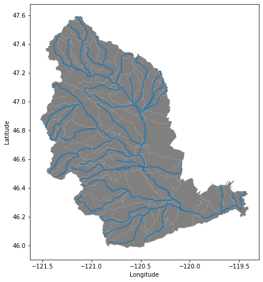
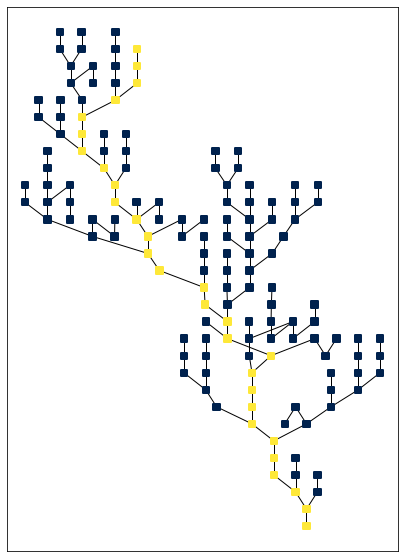
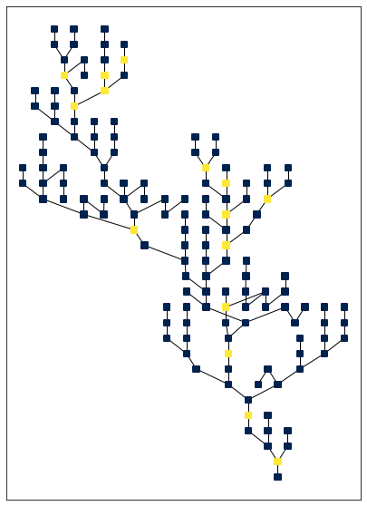
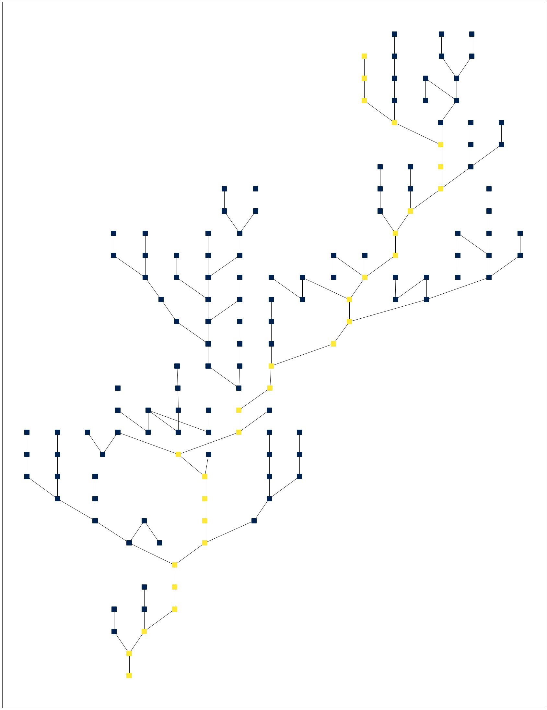
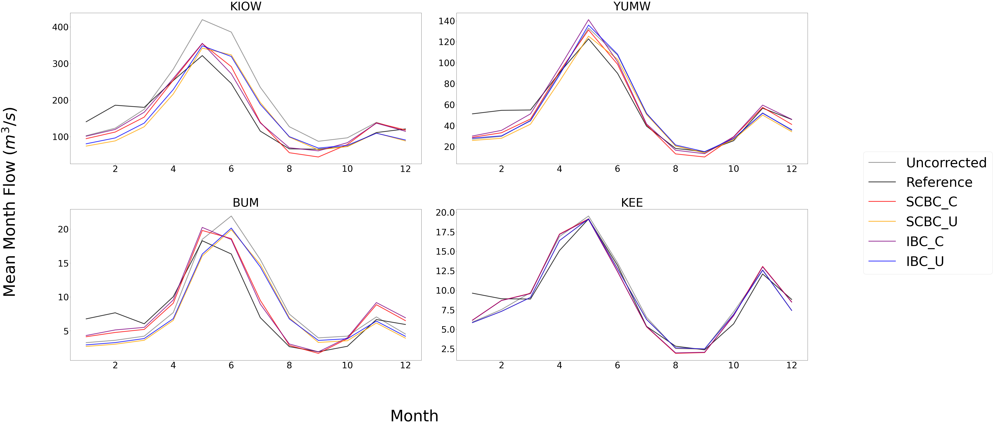
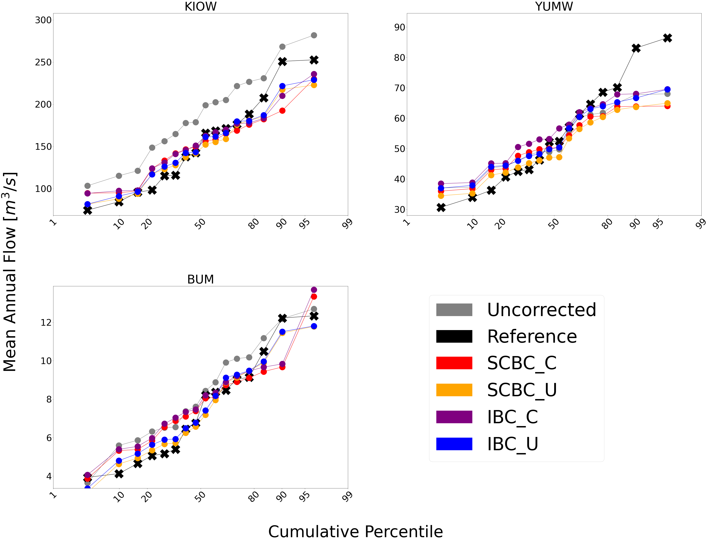
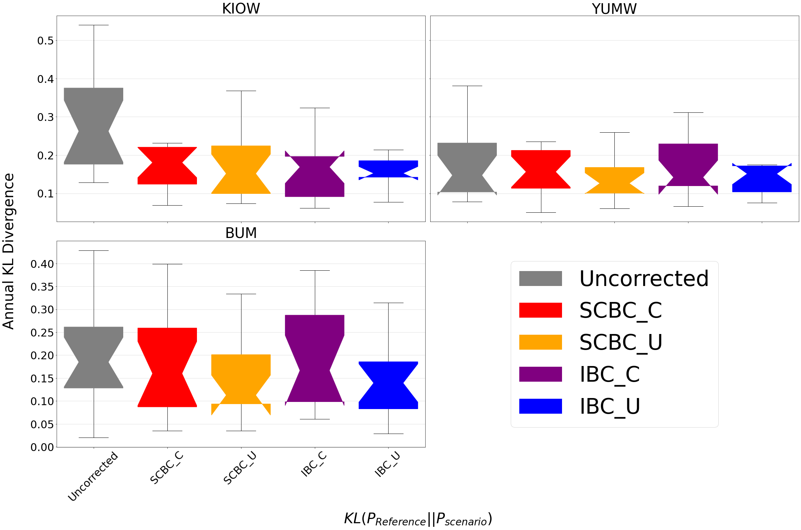
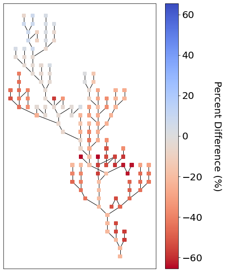

Tutorial: Getting your first bias corrections with bmorph
=========================================================

This notebook demonstrates how to setup data for and bias correct it
through **bmorph**, it contains the same information as the
`tutorial <bmorph_tutorial.rst>`__ page. In this notebook, we will
demonstrate how to perform four variations of bias correction.

-  Independent Bias Correction: Univariate (IBC_U) : IBC_U is the
   traditional bias correction method. This method can only be performed
   at sites with reference data.
-  Independent Bias Correction: Conditioned (IBC_C) : IBC_C allows for
   correcting for specific biases that are process-dependent. This
   method can only be performed at sites with reference data.
-  Spatially Consistent Bias Correction: Univariate (SCBC_U): SCBC_U
   corrects local flows at each river reach in the network, and then
   reroutes them to aggregate, producing bias corrected flows
   everywhere.
-  Spatially Consistent Bias Correction: Conditioned (SCBC_C): SCBC_C
   also corrects the local flows like SCBC_U, but allows for
   conditioning on dependent processes.

Expectations using this Tutorial
--------------------------------

Before we begin, we are expecting that anyone using this notebook is
already familiar with the following:

-  ``Python 3``

   -  fundamental syntax and logic
   -  `geopandas <https://geopandas.org/>`__
   -  `pandas <https://pandas.pydata.org/>`__
   -  `xarray <http://xarray.pydata.org/en/stable/>`__
   -  `matplotlib <https://matplotlib.org/>`__
   -  `pyplot <https://matplotlib.org/stable/tutorials/introductory/pyplot.html>`__
   -  `tqdm <https://tqdm.github.io/>`__
   -  `dask <https://dask.org/>`__
   -  `wget <https://pypi.org/project/wget/>`__
   -  `mizuRoute <https://mizuroute.readthedocs.io/en/latest/>`__

-  `Jupyterlab
   Notebooks <https://jupyterlab.readthedocs.io/en/stable/user/notebook.html>`__

   -  how to execute code

While proficiency with each item is not required to understand the
notebook, the details of these items will not be included in the
tutorial itself.

This tutorial will take \____\_ - \____\_ minutes.

Import Packages and Load Data
-----------------------------

We start by importing the necessary packages for the notebook. This
notebook mainly shows how to use ``bmorph.core.workflows`` and
``bmorph.core.mizuroute_utils`` to bias correct streamflow data in the
Yakima river basin.

.. code:: ipython3

    %pylab inline
    %load_ext autoreload
    %autoreload 2
    %reload_ext autoreload
    import warnings
    warnings.filterwarnings('ignore')
    import os
    import sys
    import numpy as np
    import xarray as xr
    import pandas as pd
    import geopandas as gpd
    import matplotlib as mpl
    import matplotlib.pyplot as plt
    from tqdm.notebook import tqdm
    from dask.distributed import Client, progress
    
    # Set a bigger default plot size
    mpl.rcParams['figure.figsize'] = (10, 8)
    
    # Import bmorph, and mizuroute utilities
    import bmorph
    from bmorph.util import mizuroute_utils as mizutil
    from bmorph.evaluation import plotting as bplot
    
    # Set the environment directory, this is a workaround for portability
    envdir = os.path.dirname(sys.executable)
    
    # Import pyproj and set the data directory, this is a workaround for portability
    import pyproj
    pyproj.datadir.set_data_dir(f'{envdir}/../share/proj')

Getting mizuroute and sample data
---------------------------------

The following code cell has three commands preceded by ``!``, which
indicates that they are shell command. The first command will install
mizuroute into the environment. The second two will download the sample
data and unpackage it. The sample data can be viewed as a HydroShare
resource
`here <https://www.hydroshare.org/resource/fd2a347d34f145b4bfa8b6bff39c782b/>`__.
This cell may take a few moments.

.. code:: ipython3

    ! conda install -c conda-forge mizuroute -y
    ! wget https://www.hydroshare.org/resource/fd2a347d34f145b4bfa8b6bff39c782b/data/contents/bmorph_testdata.tar.gz
    ! tar xvf bmorph_testdata.tar.gz

Sample data study site: the Yakima river basin
----------------------------------------------

Before getting into how to run bmorph, let’s look at what is in the
sample data. You will note that we now have a ``yakima_workflow``
directory. This contains all of the data that you need to run the
tutorial. There are a few subdirectories:

-  ``gis_data``: contains shapefiles, this is mainly used for plotting,
   not for analysis
-  ``input``: this is the input meteorologic data, simulated streamflow
   to be corrected, and the reference flow dataset
-  ``mizuroute_configs``: this is an empty directory that will
   automatically be populated with mizuroute configuration files during
   the bias correction process
-  ``output``: this is an empty directory that will be where the bias
   corrected flows will be written out to
-  ``topologies``: this contains the stream network topologies that will
   be used for routing flows via mizuroute

The Yakima river basin is a tributary of the Columbia river basin in the
Pacific northwestern United States. It’s western half is situated in the
Cascade mountains and receives seasonal snowpack. The eastern half is
lower elevation and is semi-arid. Let’s load up the shapefiles for the
sub-basins and stream network and plot it. In this discretization we
have 285 sub-basins (HRU) and 143 stream segments.

.. code:: ipython3

    yakima_hru = gpd.read_file('./yakima_workflow/gis_data/yakima_hru.shp').to_crs("EPSG:4326")
    yakima_seg = gpd.read_file('./yakima_workflow/gis_data/yakima_seg.shp').to_crs("EPSG:4326")
    
    ax = yakima_hru.plot(color='grey')
    yakima_seg.plot(ax=ax)
    ax.set_xlabel('Longitude')
    ax.set_ylabel('Latitude')

Setting up some metadata
------------------------

Next you provide the gauge site names and their respective river segment
identification numbers, or ``site``\ ’s and ``seg``\ ’s. This will be
used throughout to ensure the data does not get mismatched.

bmorph uses the convention:
``site_to_seg = { site_0_name : site_0_seg, ..., site_n_name, site_n_seg}``

.. code:: ipython3

    site_to_seg = {'KEE' : 4175, 'KAC' : 4171, 'EASW': 4170, 
                   'CLE' : 4164, 'YUMW': 4162, 'BUM' : 5231,
                   'AMRW': 5228,  'CLFW': 5224,  'RIM' : 5240,
                   'NACW': 5222, 'UMTW': 4139,  'AUGW': 594,  
                   'PARW': 588,   'YGVW': 584,   'KIOW': 581}

Since it is convenient to be able to access this data in different
orders we also set up some other useful forms of these gauge site
mappings for later use.

.. code:: ipython3

    seg_to_site = {seg: site for site, seg in site_to_seg.items()}
    ref_sites = list(site_to_seg.keys())
    ref_segs = list(site_to_seg.values())    

Next we load in stream network topology (topo), meteorological data
(met), uncorrected flows (raw), and reference flows (ref). **The
topology is based on a Geo-Spatial Fabric.** A description of how your
project directory is expected to be set up can be found in `the
documentation <https://bmorph.readthedocs.io/en/develop/data.html>`__.

.. code:: ipython3

    yakima_topo = xr.open_dataset('yakima_workflow/topologies/yakima_huc12_topology.nc').load()

Here we load in some example meteorological data that will be used for
conditional bias correction: daily minimum temperature (``tmin``),
seasonal precipitation (``prec``), and daily maximum temperature
(``tmax``). In principle, any type of data can be used for conditioning.

.. code:: ipython3

    yakima_met = xr.open_dataset('yakima_workflow/input/yakima_met.nc').load()
    yakima_met['hru'] = (yakima_met['hru'] - 1.7e7).astype(np.int32)

Finally, we load the simulated flows and reference flows. bmorph is
designed to bias correct streamflow simulated with
`mizuroute <https://mizuroute.readthedocs.io/en/latest/>`__. We denote
the simulated flows as the “raw” flows when they are uncorrected, and
the flows that will be used to correct the raw flows as the reference
flows. In our case the reference flows are estimated
no-reservoir-no-irrigation (NRNI) flows taken from the `River Management
Joint Operating Committee
(RMJOC) <https://www.bpa.gov/p/Generation/Hydro/Documents/RMJOC-II_Part_II.PDF>`__.

.. code:: ipython3

    # Raw flows
    yakima_raw = xr.open_dataset('yakima_workflow/input/yakima_raw_flows.nc')[['IRFroutedRunoff', 'dlayRunoff', 'reachID']].load()
    # Update some metadata
    yakima_raw['seg'] = yakima_raw.isel(time=0)['reachID'].astype(np.int32)
    
    # Reference flows - this contains sites from the entire Columbia river basin
    yakima_ref = xr.open_dataset('yakima_workflow/input/nrni_reference_flows.nc').rename({'outlet':'site'})[['seg', 'seg_id', 'reference_flow']]
    # Pull out only the sites in the Yakima basin
    yakima_ref = yakima_ref.sel(site=ref_sites).load()

Utilizing the Simple River Network
----------------------------------

We can use the `SimpleRiverNetwork <srn.rst>`__ as an evaluative tool to
take a deeper look into the ``bmorph`` process later, so let’s see how
it compares to the map right now.

.. code:: ipython3

    from bmorph.evaluation import simple_river_network as srn

All we need to set up the SimpleRiverNetwork (SRN) is the topology of
the watershed (``yakima_topo``). We are not going to consider external
watersheds such as the Columbia, so we will set the first Pfaffstetter
digit to nothing. In the instance that the outlet of the watershed is
not the first entry in the topology file, ``outlet_index=0`` would need
to be specified besides 0. However, ``yakima_topo`` does have the outlet
as the first entry so nothing needs to change here. If we were dealing
with a massive basin we might also need to consider changing
``max_level_pfaf=42`` if we are going to have more than 42 Pfaffstetter
digits, yet the Yakima is not too big and this will be more than plenty.

.. code:: ipython3

    srn_yak = srn.SimpleRiverNetwork(topo=yakima_topo, pfaf_seed='')

Let’s orientate ourselves with the mainstream of the Yakima. We will
also give it a colormap besides the ``hsv`` default that reminds us we
were not plotting any data on the SRN.

.. code:: ipython3

    mainstream_map = srn_yak.generate_mainstream_map()
    
    fig, ax = plt.subplots(figsize=(7,10))
    srn_yak.draw_network(color_measure=mainstream_map, cmap=mpl.cm.get_cmap('cividis'), ax=ax, node_size=40)

While this may look rather different from the map, we can see how it
resembles the Yakima and can note the outlet as the bottom-most node,
which is the outlet to the Columbia River.

Since we just inputted our river segment locations, let’s also see where
they show up on the SRN

.. code:: ipython3

    mainstream_map = srn_yak.generate_node_highlight_map(ref_segs)
    
    fig, ax = plt.subplots(figsize=(7,10))
    srn_yak.draw_network(color_measure=mainstream_map, cmap=mpl.cm.get_cmap('cividis'), ax=ax, node_size=40)

Convert from ``mizuroute`` output to ``bmorph`` format
------------------------------------------------------

``mizuroute_utils`` is our utility module that will handle converting
mizuroute outputs to the format that we need for ``bmorph``. We will use
the ``mizutil.to_bmorph`` function to merge together all of the data we
previously loaded, and calculate some extra pieces of information to
perform spatially consistent bias corrections (SCBC). For more
information about how we perform SCBC see `the SCBC page in the
documentation <https://bmorph.readthedocs.io/en/develop/bias_correction.html#spatial-consistency-reference-site-selection-cdf-blend-factor>`__.
Now we pass our data in to ``to_bmorph``, the primary utility function
for automating ``bmorph`` pre-processing.

.. code:: ipython3

    yakima_met_seg = mizutil.to_bmorph(yakima_topo, yakima_raw, yakima_ref, yakima_met,  fill_method='r2')

Setting up ``bmorph`` configuration and parameters
--------------------------------------------------

Before applying bias correction we need to specify some parameters and
configuration for correction. Returning to these steps can help fine
tune your bias corrections to the basin you are analyzing.

The ``train_window`` is what we will use to train the bias correction
model. This is the time range that is representative of the basin’s
expected behavior that ``bmorph`` should mirror.

The ``bmorph_window`` is when ``bmorph`` should be applied to the series
for bias correction.

Lastly the ``reference_window`` is when the reference flows should be
used to smooth the Cumulative Distribution function (CDF) of the bias
corrected flows. This is recommended to be set as equivalent to the
``train_window``.

.. code:: ipython3

    train_window = pd.date_range('1981-01-01', '1990-12-30')[[0, -1]]
    bmorph_window = pd.date_range('1991-01-01', '2005-12-30')[[0, -1]]
    reference_window = train_window
    interval = pd.DateOffset(years=1)

``interval`` is the length of ``bmorph``\ ‘s application intervals,
typically a factor of years to preserve hydrologic relationships. Note
that for ``pandas.DateOffset``, ’year’ and ‘years’ are different and an
‘s’ should always be included here for ``bmorph`` to run properly, even
for a single year.

``overlap`` describes how many days the bias correction cumulative
distribution function windows should overlap in total with each other.
``overlap`` is evenly distributed before and after this window. This is
used to reduce discontinuities between application periods.

``condition_var`` names the variable to use in conditioning, such as
maximum temperature (tmax), seasonal precipitation (seasonal_precip), or
daily minimum temperature (tmin). At this time, only one conditioning
meteorological variable can be used per ``bmorph`` execution. In this
example, ``tmax`` and ``seasonal_precip`` have been commented out to
select ``tmin`` as the conditioning variable. If you wish to change
this, be sure to either change which variables are commented out or
change the value of ``condition_var`` itself.

Here we name some configuration parameters for ``bmorph``\ ’s
conditional and univariate bias correction methods, respectively.

``output_prefix`` will be used to write and load files according to the
basin’s name, make certain to update this with the actual name of the
basin you are analyzing so you can track where different files are
written.

.. code:: ipython3

    # Select from the various available meteorologic fields for conditioning
    #condition_var = 'tmax'
    #condition_var = 'seasonal_precip'
    condition_var = 'tmin'
    
    # bmorph parameter values
    overlap = 90
    n_smooth_long = 365
    n_smooth_short = 14
    
    conditional_config = {
        'data_path':  './yakima_workflow',
        'output_prefix': "yakima",
        'train_window': train_window,
        'bmorph_window': bmorph_window,
        'reference_window': reference_window,
        'bmorph_interval': interval,
        'bmorph_overlap': overlap,
        'n_smooth_long': n_smooth_long,
        'n_smooth_short': n_smooth_short,
        'condition_var': condition_var,
        'xbins': 100,
        'ybins': 20,
    }
    
    univariate_config = {
        'data_path':  './yakima_workflow',
        'output_prefix': "yakima",
        'train_window': train_window,
        'bmorph_window': bmorph_window,
        'reference_window': reference_window,
        'bmorph_interval': interval,
        'bmorph_overlap': overlap,
        'n_smooth_long': n_smooth_long,
        'n_smooth_short': n_smooth_short,
    }

You made it! Now we can actually bias correction with ``bmorph``!

First off we run the Independent Bias Corrections, which are completely
contained in the cell below.

Here we run through each of the gauge sites and correct them
individually. Since independent bias correction can only be performed at
locations with reference data, corrections are only performed at the
gauge sites here.

Independent bias correction
---------------------------

.. code:: ipython3

    ibc_u_flows = {}
    ibc_u_mults = {}
    ibc_c_flows = {}
    ibc_c_mults = {}
    
    raw_flows = {}
    ref_flows = {}
    for site, seg in tqdm(site_to_seg.items()):
        raw_ts =   yakima_met_seg.sel(seg=seg)['IRFroutedRunoff'].to_series()
        train_ts = yakima_met_seg.sel(seg=seg)['IRFroutedRunoff'].to_series()
        obs_ts =   yakima_met_seg.sel(seg=seg)['up_ref_flow'].to_series()
        cond_var = yakima_met_seg.sel(seg=seg)[f'up_{condition_var}'].to_series()
        ref_flows[site] = obs_ts
        raw_flows[site] = raw_ts
    
        ## IBC_U (Independent Bias Correction: Univariate)
        ibc_u_flows[site], ibc_u_mults[site] = bmorph.workflows.apply_interval_bmorph(
            raw_ts, train_ts, obs_ts, train_window, bmorph_window, reference_window, interval, overlap)
    
        ## IBC_C (Independent Bias Correction: Conditioned)
        ibc_c_flows[site], ibc_c_mults[site] = bmorph.workflows.apply_interval_bmorph(
            raw_ts, train_ts, obs_ts, train_window, bmorph_window, reference_window, interval, overlap,
            raw_y=cond_var, train_y=cond_var, obs_y=cond_var)

Spatially consistent bias correction
------------------------------------

Here we specify where the ``mizuroute`` executable is installed on your
system.

.. code:: ipython3

    mizuroute_exe = f'{envdir}/route_runoff.exe'

Now we use ``run_parallel_scbc`` to do the rest. The next two cells may
each take up to 3 minutes to run. In the first cell we will run the
spatially-consistent bias correction without any conditioning. The
second cell will run the spatially-consistent bias correction with
conditioning. This produced bias corrected flows at all 143 stream
segments in the Yakima river basin. Finally, we select out the corrected
streamflows for both cases (with and without conditioning) to only
contain the gauged sites. Selecting out only the gauged locations allows
us to compare the spatially-consistent methods with the independent bias
corrections. Finally we combine all the data into a single xarray
``Dataset`` to make analysis easier.

.. code:: ipython3

    # SCBC without conditioning
    unconditioned_seg_totals = bmorph.workflows.run_parallel_scbc(yakima_met_seg, mizuroute_exe, univariate_config)

.. code:: ipython3

    # SCBC with conditioning
    conditioned_seg_totals = bmorph.workflows.run_parallel_scbc(yakima_met_seg, mizuroute_exe, conditional_config)

.. code:: ipython3

    # Here we select out our rerouted gauge site modeled flows.
    unconditioned_site_totals = {}
    conditioned_site_totals = {}
    for site, seg in tqdm(site_to_seg.items()):
        unconditioned_site_totals[site] = unconditioned_seg_totals['IRFroutedRunoff'].sel(seg=seg).to_series()
        conditioned_site_totals[site] = conditioned_seg_totals['IRFroutedRunoff'].sel(seg=seg).to_series()

.. code:: ipython3

    # Merge everything together
    yakima_analysis = xr.Dataset(coords={'site': list(site_to_seg.keys()), 'time': conditioned_seg_totals['time']})
    yakima_analysis['scbc_c'] = bmorph.workflows.bmorph_to_dataarray(conditioned_site_totals, 'scbc_c')
    yakima_analysis['scbc_u'] = bmorph.workflows.bmorph_to_dataarray(unconditioned_site_totals, 'scbc_u')
    yakima_analysis['ibc_u'] = bmorph.workflows.bmorph_to_dataarray(ibc_u_flows, 'ibc_u')
    yakima_analysis['ibc_c'] = bmorph.workflows.bmorph_to_dataarray(ibc_c_flows, 'ibc_c')
    yakima_analysis['raw'] = bmorph.workflows.bmorph_to_dataarray(raw_flows, 'raw')
    yakima_analysis['ref'] = bmorph.workflows.bmorph_to_dataarray(ref_flows, 'ref')
    yakima_analysis.to_netcdf(f'./yakima_workflow/output/{univariate_config["output_prefix"]}_data_processed.nc')

.. code:: ipython3

    # And also output it as some CSV files
    yakima_analysis['scbc_c'].to_pandas().to_csv(f'./yakima_workflow/output{univariate_config["output_prefix"]}_data_processed_scbc_c.csv')
    yakima_analysis['scbc_u'].to_pandas().to_csv(f'./yakima_workflow/output{univariate_config["output_prefix"]}_data_processed_scbc_u.csv')
    yakima_analysis['ibc_u'].to_pandas().to_csv(f'./yakima_workflow/output{univariate_config["output_prefix"]}_data_processed_ibc_u.csv')
    yakima_analysis['ibc_c'].to_pandas().to_csv(f'./yakima_workflow/output{univariate_config["output_prefix"]}_data_processed_ibc_u.csv')
    yakima_analysis['raw'].to_pandas().to_csv(f'./yakima_workflow/output{univariate_config["output_prefix"]}_data_processed_raw.csv')
    yakima_analysis['ref'].to_pandas().to_csv(f'./yakima_workflow/output{univariate_config["output_prefix"]}_data_processed_ref.csv')

Now let’s take a look at our results
------------------------------------

If you look closely, the following plots are the same ones included in
`Plotting <evaluation.rst/Plotting>`__! Because the plotting functions
expect the variable ``seg``, we will need to conflate ``site`` and
``seg`` for them to properly run.

.. code:: ipython3

    yakima_ds = xr.open_dataset(f'yakima_workflow/output/{univariate_config["output_prefix"]}_data_processed.nc')
    yakima_ds = yakima_ds.rename({'site':'seg'})

Let’s pick a few sites and colors to plot for consistency. To simplify
our plots, we will only focus on ``scbc_c`` in the dataset we just
created. The methods do allow for multiple methods to be compared at
once however, so we will still need to store the singular ``scbc_c`` in
a list.

Feel free to mess around with the parameters of any of these plots. You
can plot more sites if desired, or more methods, just make certain
arguments properly line up.

.. code:: ipython3

    select_sites = ['KIOW','YUMW','BUM']
    select_sites_2 = ['KIOW','YUMW','BUM','KEE']
    bcs = ['scbc_c', 'scbc_u', 'ibc_c', 'ibc_u']
    colors = ['grey', 'black', 'red', 'orange', 'purple', 'blue']

Scatter
~~~~~~~

Scatter plots are most useful for comparing absolute error before and
after bias correction.

.. code:: ipython3

    bplot.compare_correction_scatter(
        flow_dataset= yakima_ds, 
        plot_sites = select_sites,
        raw_var = 'raw', 
        ref_var = 'ref', 
        bc_vars = bcs, 
        bc_names = [bc.upper() for bc in bcs],
        plot_colors = list(colors[2:]),
        pos_cone_guide = True,
        neg_cone_guide = True,
        symmetry = False,
        title = '',
        fontsize_legend = 120,
        alpha = 0.3
    )

This compares how absolute error changes through each bias correction
with Q being stream discharge. 1 to 1 and -1 to 1 lines are plotted for
reference, as points plotted vertically between the lines demonstrates a
reduction in absolute error while points plotted horizontally between
the lines demonstrates an increase in absolute error for each flow time.

Time Series
~~~~~~~~~~~

Time series being widely used in hydrology can help us understand
temporal changes in bias correction.

.. code:: ipython3

    bplot.plot_reduced_flows(
        flow_dataset= yakima_ds, 
        plot_sites = select_sites_2, 
        interval = 'month',
        raw_var = 'raw', raw_name = "Uncorrected",
        ref_var = 'ref', ref_name = "Reference",
        bc_vars = bcs, bc_names = [bc.upper() for bc in bcs],
        plot_colors = colors
    )

Here, averages are computed on weekly intervals to simplify the figure,
but can also be plotted on daily or monthly intervals for more or less
granularity. Comparing this with median flows can describe how much the
mean is impacted by extreme flows.

The above plot showcases the conditioned methods as following the shape
of the reference distribution more than the unconditioned method.
Greater similarities in the methods are notable through conditioning
that independent versus spatially consistent bias correction.

Probabilitiy Distribtutions
~~~~~~~~~~~~~~~~~~~~~~~~~~~

Since probability distributions are used to predict extreme flow events
and are what ``bmorph`` directly corrects, looking at them will give us
greater insight to the changes we made.

.. code:: ipython3

    bplot.compare_mean_grouped_CPD(
        flow_dataset= yakima_ds, 
        plot_sites = select_sites,
        grouper_func = bplot.calc_water_year, 
        figsize = (60,40),
        raw_var = 'raw', raw_name = 'Uncorrected',
        ref_var = 'ref', ref_name = 'Reference',
        bc_vars = bcs, bc_names = [bc.upper() for bc in bcs],
        plot_colors = colors,
        linestyles = 2 * ['-','-','-'],
        markers = ['o', 'X', 'o', 'o', 'o', 'o'],
        fontsize_legend = 90,
        legend_bbox_to_anchor = (1.9,1.0)
    )

This function is also capable of subsetting data by month should you
want to compare only January flows for example. Because ``bmorph`` makes
changes based on flow distributions, this plot is the closest to
directly analyzing how the different methods correct flows.

Box & Whisker
~~~~~~~~~~~~~

Kullback-Leibler Divergence, or relative entropy, is used to describe
how similar predicted and observation distributions are. Taken from
Information Theory, KL Divergence describes the error in using one
probability distribution in place of another, turning out to be a strong
statistic to analyze how ``bmorph`` corrects probability distributions
of stream flows. A KL Divergence value of 0 symbolizes a perfect match
between the two probability distributions, or no error in assuming the
one distribution in place of the other.

.. code:: ipython3

    bplot.kl_divergence_annual_compare(
        flow_dataset= yakima_ds, 
        sites = select_sites,
        fontsize_legend = 60, title = '',
        raw_var = 'raw', raw_name = 'Uncorrected',
        ref_var = 'ref', ref_name = 'Reference',
        bc_vars = bcs, bc_names = [bc.upper() for bc in bcs],
        plot_colors = ['grey','red', 'orange', 'purple', 'blue']
    )

Being able to view KL Divergence for different scenarios side-by-side
helps to provide a better understanding of how well probability
distributions are being fitted across the entire time provided.

Simple River Network
~~~~~~~~~~~~~~~~~~~~

Lastly, let’s do a basic plot percent difference between the uncorrected
and ``SCBC_C`` flows on the SRN to understand the spatial dynamics a bit
more.

.. code:: ipython3

    scbc_c = conditioned_seg_totals['IRFroutedRunoff']
    raw = yakima_met_seg['IRFroutedRunoff']
    p_diff = ((scbc_c-raw)/raw).mean(dim='time')*100

.. code:: ipython3

    percent_diff = pd.Series(data=p_diff.to_pandas().values,index=mainstream_map.index)

.. code:: ipython3

    fig, ax = plt.subplots(figsize=(7,10))
    srn_yak.draw_network(color_measure=percent_diff, cmap=mpl.cm.get_cmap('coolwarm_r'), node_size=40,
                         with_cbar=True, cbar_labelsize=20, ax=ax, cbar_title='Percent Difference (%)')

