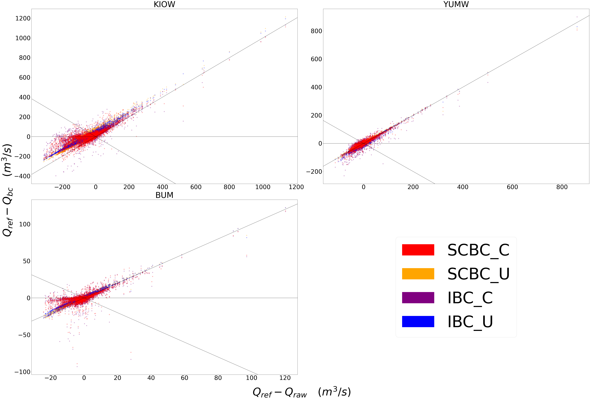
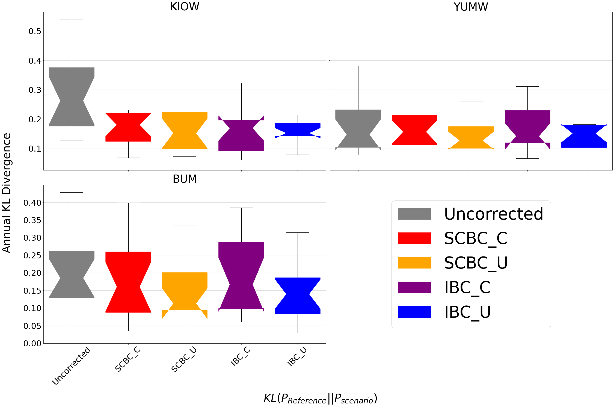

Tutorial: Getting your first bias corrections with bmorph
=========================================================

This notebook demonstrates how to setup data for and bias correct it
through **bmorph**, containing the same information as the
`Binder notebook <https://mybinder.org/v2/gh/UW-Hydro/bmorph/develop>`_.

Import Packages and Load Data
-----------------------------

We will be using numpy, xarray, and pandas in this example notebook.
Note: numpy can imported directly intsead of using magic,
``%pylab inline`` if desired. More on Built-in magic commands can be
found
`here <https://ipython.readthedocs.io/en/stable/interactive/magics.html>`__.

.. code:: ipython3

    %pylab inline
    %load_ext autoreload
    %autoreload 2
    %reload_ext autoreload
    import os
    import sys
    import xarray as xr
    import pandas as pd
    from tqdm.notebook import tqdm

.. parsed-literal::

    Populating the interactive namespace from numpy and matplotlib

We will mainly deal with ``bmorph.core.workflows``, our primary
organizing script, but will also use ``bmorph.core.mizuroute_utils`` to
pre-process your data for bmorph.

.. code:: ipython3

    import bmorph
    from bmorph.util import mizuroute_utils as mizutil

.. parsed-literal::

    /pool0/data/andrbenn/workspace/bmorph/bmorph/core/bmorph.py:18: FutureWarning: The pandas.np module is deprecated and will be removed from pandas in a future version. Import numpy directly instead
      pd.np.seterr(divide='raise')
    /pool0/data/andrbenn/.conda/bmorph/lib/python3.9/site-packages/pyproj/__init__.py:76: UserWarning: pyproj unable to set database path.
      _pyproj_global_context_initialize()

Setting up a client for parallelism can help speed up the process of
bias correction immensely, espeically if you are working with large
numbers of watersheds. Calibrating which meteorological variable you
want to condition to can take some time, so parralelism is recommended
in especially the initial uses of ``bmorph``.

.. code:: ipython3

    from dask.distributed import Client, progress

.. code:: ipython3

    ! wget https://www.hydroshare.org/resource/fd2a347d34f145b4bfa8b6bff39c782b/data/contents/bmorph_testdata.tar.gz

.. code:: ipython3

    ! tar xvf bmorph_testdata.tar.gz

In case you are just copying this over, the client is only set up with
one thread and one worker to prevent accidentally overburdening any
machine this is running on. If you actually want to use parallelism,
make sure to change this!

.. code:: ipython3

    client = Client(threads_per_worker=1, n_workers=1) #Increase for parallel power!!!

.. parsed-literal::

    /pool0/data/andrbenn/.conda/bmorph/lib/python3.9/site-packages/distributed/node.py:151: UserWarning: Port 8787 is already in use.
    Perhaps you already have a cluster running?
    Hosting the HTTP server on port 34063 instead
      warnings.warn(

Next you provide the gauge site names and their respective river segment
identification numbers, or ``site``\ ’s and ``seg``\ ’s. This will be
used throughout to ensure the data does not get mismatched.

We will use the format:
``site_to_seg = { site_0_name : site_0_seg, ..., site_n_name, site_n_seg}``

.. code:: ipython3

    site_to_seg = {'KEE' : 4175, 'KAC' : 4171, 'EASW': 4170, 
                       'CLE' : 4164, 'YUMW': 4162, 'BUM' : 5231,
                       'AMRW': 5228,  'CLFW': 5224,  'RIM' : 5240,
                       'NACW': 5222, 'UMTW': 4139,  'AUGW': 594,  
                       'PARW': 588,   'YGVW': 584,   'KIOW': 581}

Since it is nice to be able to access the data you just filled out
without much struggle, here we create some other useful forms of these
gauge site mappings for later use.

.. code:: ipython3

    seg_to_site = {seg: site for site, seg in site_to_seg.items()}
    ref_sites = list(site_to_seg.keys())
    ref_segs = list(site_to_seg.values())    

Next we load in topographical data (topo), meterological data (met),
uncorrected flows (raw), and reference flows (ref). Note that some
fields have placeholder names that you should update before running. If
some data is not accessible in a single function call, be sure to
collapse it into a single file first before loading them. File
designation calls assume this code is in a folder seperate from the
data, but that this code’s containing folder is at the same heirarchy as
the folders containing the data. A description of how your project
directory is expected to be set up can be found in ``data.rst``.

.. code:: ipython3

    basin_topo = xr.open_dataset('yakima_workflow/topologies/yakima_huc12_topology.nc').load()

Sometimes meteorological data may only be available for a larger region
or watershed than anlayzing, so the following data will be described
under such an assumption.

Here we load in some example meteorological data: daily minimum
temperature (tmin), seasonal precipitation (prec), and daily maximum
temperature (tmax). You can use similar or completely different data,
just note naming should be universally updated and unused names should
be deleted or commented out completely.

.. code:: ipython3

    watershed_met = xr.open_dataset('yakima_workflow/input/yakima_met.nc').load()
    watershed_met['hru'] = (watershed_met['hru'] - 1.7e7).astype(np.int32)

Hydrologic response units (hru’s) are the typical coordinate for
meteorologic data. Later, mizuroute_utils will take care of mapping
these hru’s to seg’s.

And last not be certainly not least, we need the flows themselves!
``bmorph`` is designed to bias correct simulated streamflow as modeled
by `mizuroute <https://mizuroute.readthedocs.io/en/latest/>`__. As a
result, loading up the raw flows involves combining a number of flow
netcdf files, hence the ``open_mfdataset``.

.. code:: ipython3

    watershed_raw = xr.open_dataset('yakima_workflow/input/yakima_raw_flows.nc')[['IRFroutedRunoff', 'dlayRunoff', 'reachID']].load()
    watershed_raw['seg'] = watershed_raw.isel(time=0)['reachID'].astype(np.int32)
    watershed_ref = xr.open_dataset('yakima_workflow/input/nrni_reference_flows.nc').load().rename({'outlet':'site'})[['seg', 'seg_id', 'reference_flow']]

In order to select data for the basin of analysis from the larger
watershed, we need the topology of the larger watershed as well.

.. code:: ipython3

    watershed_topo = xr.open_dataset('yakima_workflow/topologies/yakima_huc12_topology.nc').load()
    watershed_topo = watershed_topo.where(watershed_topo['hru'] < 1.79e7, drop=True)

Here we clean up a few naming conventions to get everything on the same
page in accordance with ``data.rst``.

Convert ``mizuroute`` formatting to ``bmorph`` formatting
---------------------------------------------------------

``mizuroute_utils`` is our utility script that will handle converting
Mizuroute outputs to what we need for ``bmorph``. For more information
on what ``mizuroute_utils`` does specifically and how to change its
parameters, check out ``data.rst``.

Here we pull out coordinate data from the ovearching watershed for the
specific basin we want to analyze.

.. code:: ipython3

    basin_ref = watershed_ref.sel(site=[r for r in ref_sites])
    
    for site, seg in site_to_seg.items():
        if site in basin_ref['site']:
            basin_ref['seg'].loc[{'site': site}] = seg

Now we pass it off to ``mizuroute_to_blendmorph``, the primary utility
function for automating ``bmorph`` pre-procesing.

.. code:: ipython3

    basin_met_seg = mizutil.mizuroute_to_blendmorph(
        basin_topo, watershed_raw.copy(), basin_ref, watershed_met, 
        fill_method='r2').ffill(dim='seg')

Apply ``bmorph`` bias correction
--------------------------------

We are almost to actually bias correcting! First we need to specify some
parameters for correction. Returning to these parameters can help fine
tune your bias corrections to the basin you are analyzing.

In this notebook, all four variations of ``bmorph`` are demonstrated:
IBC_U, IBC_C, SCBC_U, and SCBC_C, as described in
``bias_correction.rst``.

The ``train_window`` is what we will use to train the bias correction
model. This is the time range that is representative of the basin’s
expected behavior that ``bmorph`` should mirror.

The ``bmorph_window`` is when ``bmorph`` should be applied to the series
for bias correction.

Lastly the ``reference_window`` is when the reference flows should be
used to smooth the bias corrected flows. This is recommended to be set
as equivalent to the ``train_window``.

.. code:: ipython3

    train_window = pd.date_range('1981-01-01', '1990-12-30')[[0, -1]]
    bmorph_window = pd.date_range('1991-01-01', '2005-12-30')[[0, -1]]
    reference_window = train_window

``interval`` is the length of\ ``bmorph``\ ‘s application intervals,
typically a factor of years to preserve hydrologic relationships. Note
that for ``pandas.DateOffset``, ’year’ and ‘years’ are different and an
‘s’ should always be included here for ``bmorph`` to run properly, even
for a single year.

``overlap`` describes how many days the bias correction cumulative
distribtuion function windows should overlap in total with each other.
``overlap`` is evenly distributed before and after this window. This is
used to reduce discontinuities between application periods.

``condition_var`` names the variable to use in conditioning, such as
maximum temperature (tmax), seasonal precipitation (seasonal_precip), or
daily minimum temperature (tmin). At this time, only one conditioning
meteorological variable can be used per ``bmorph`` execution. In this
example, ``tmax`` and ``seasonal_precip`` have been commented out to
select ``tmin`` as the conditioning variable. If you wish to change
this, be sure to either change which variables are commented out or
change the value of ``condition_var`` itself.

.. code:: ipython3

    interval = pd.DateOffset(years=1)
    overlap = 90
    
    #condition_var = 'tmax'
    #condition_var = 'seasonal_precip'
    condition_var = 'tmin'

Here we name some configuration parameters for ``bmorph``\ ’s
conditional and univariate bias correction metods, respectively. If you
have been following along with the rest of the naming conventions in
this section so far, then there is nothing you need to change here.

.. code:: ipython3

    conditonal_config = {
        'data_path':  './yakima_workflow',
        'output_prefix': "yakima",
        'train_window': train_window,
        'bmorph_window': bmorph_window,
        'reference_window': reference_window,
        'bmorph_interval': interval,
        'bmorph_overlap': overlap,
        'condition_var': condition_var
    }
    
    univariate_config = {
        'data_path':  './yakima_workflow',
        'output_prefix': "yakima",
        'train_window': train_window,
        'bmorph_window': bmorph_window,
        'reference_window': reference_window,
        'bmorph_interval': interval,
        'bmorph_overlap': overlap,
    }

You made it! Now we can actually bias correction with ``bmorph``!
Depending on the size of your data and use of parallelism or not, the
following cells will likely take the longest to run, so make certain
everything else looks good to you before running it.

First off we run the Independent Bias Corrections, which is completely
contained in the cell below. If you are interested in ``bmorph``\ ’s
spatial consitency and conditioing bias corrections, this cell is not
it. However, it can be useful to run at least once so you have a
baseline method to compare to as you fine tune variables.

Here we run through each of the gauge sites and correct them
individually. Since independent bias correction can only be performed at
locations with reference data, corrections are only performed at the
gauge sites here. If you have not changed any naming conventions so far,
then there is nothing that you need to alter here, it has all already
been extracted above for your convenience.

.. code:: ipython3

    ibc_u_flows = {}
    ibc_u_mults = {}
    ibc_c_flows = {}
    ibc_c_mults = {}
    
    raw_flows = {}
    ref_flows = {}
    
    for site, seg in tqdm(site_to_seg.items()):
        raw_ts = basin_met_seg.sel(seg=seg)['IRFroutedRunoff'].to_series()
        train_ts = basin_met_seg.sel(seg=seg)['IRFroutedRunoff'].to_series()
        obs_ts = basin_met_seg.sel(seg=seg)['up_ref_flow'].to_series()
        cond_var = basin_met_seg.sel(seg=seg)[f'up_{condition_var}'].to_series()
        ref_flows[site] = obs_ts
        raw_flows[site] = raw_ts
    
        ## IBC_U (Independent Bias Correction: Univariate)
        ibc_u_flows[site], ibc_u_mults[site] = bmorph.workflows.apply_interval_bmorph(
            raw_ts, train_ts, obs_ts, train_window, bmorph_window, reference_window, interval, overlap)
    
        ## IBC_C (Independent Bias Correction: Conditioned)
        ibc_c_flows[site], ibc_c_mults[site] = bmorph.workflows.apply_interval_bmorph(
            raw_ts, train_ts, obs_ts, train_window, bmorph_window, reference_window, interval, overlap,
            raw_y=cond_var, train_y=cond_var, obs_y=cond_var)

.. parsed-literal::

      0%|          | 0/15 [00:00<?, ?it/s]

.. parsed-literal::

    /pool0/data/andrbenn/workspace/bmorph/bmorph/core/bmorph.py:141: FutureWarning: The pandas.np module is deprecated and will be removed from pandas in a future version. Import numpy directly instead
      train_x = pd.np.percentile(train_cdf, u_t)
    /pool0/data/andrbenn/workspace/bmorph/bmorph/core/bmorph.py:145: FutureWarning: The pandas.np module is deprecated and will be removed from pandas in a future version. Import numpy directly instead
      truth_x = pd.np.percentile(truth_cdf, u_t)
    /pool0/data/andrbenn/workspace/bmorph/bmorph/core/bmorph.py:43: FutureWarning: Support for multi-dimensional indexing (e.g. `obj[:, None]`) is deprecated and will be removed in a future version.  Convert to a numpy array before indexing instead.
      locs =  np.argmin(np.abs(vals[:, np.newaxis] - y_raw), axis=1)
    /pool0/data/andrbenn/workspace/bmorph/bmorph/core/bmorph.py:75: FutureWarning: Support for multi-dimensional indexing (e.g. `obj[:, None]`) is deprecated and will be removed in a future version.  Convert to a numpy array before indexing instead.
      u_t = raw_cdfs[np.argmin(np.abs(raw_x[:, np.newaxis] - x_raw), axis=1), nx]

Here you specify where ``mizuroute`` is installed on your system and set
up some variables to store total flows.

``output_prefix`` will be used to write and load files according to the
basin’s name, make certain to update this with the actual name of the
basin you are analyzing so you can track where different files are
writen.

.. code:: ipython3

    mizuroute_exe = f'{os.path.dirname(sys.executable)}/route_runoff.exe' # mizuroute designation
    
    
    unconditioned_seg_totals = {}
    conditioned_seg_totals = {}
    unconditioned_site_totals = {}
    conditioned_site_totals = {}

Now we use ``run_parallel_scbc`` to do the rest! This may take a while …

.. code:: ipython3

    unconditioned_seg_totals = bmorph.workflows.run_parallel_scbc(basin_met_seg, client, mizuroute_exe, univariate_config)
    conditioned_seg_totals = bmorph.workflows.run_parallel_scbc(basin_met_seg, client, mizuroute_exe, conditonal_config)
    # Here we select out our rerouted gauge site modeled flows.
    for site, seg in tqdm(site_to_seg.items()):
        unconditioned_site_totals[site] = unconditioned_seg_totals['IRFroutedRunoff'].sel(seg=seg).to_series()
        conditioned_site_totals[site] = conditioned_seg_totals['IRFroutedRunoff'].sel(seg=seg).to_series()

.. parsed-literal::

    /pool0/data/andrbenn/.conda/bmorph/lib/python3.9/site-packages/distributed/worker.py:3557: UserWarning: Large object of size 2.28 MB detected in task graph: 
      (<xarray.Dataset>
    Dimensions:               (time: ... . 7.513 8.827,)
    Consider scattering large objects ahead of time
    with client.scatter to reduce scheduler burden and 
    keep data on workers
    
        future = client.submit(func, big_data)    # bad
    
        big_future = client.scatter(big_data)     # good
        future = client.submit(func, big_future)  # good
      warnings.warn(

.. parsed-literal::

      0%|          | 0/15 [00:00<?, ?it/s]

Lastly we combine all the data into a singular xarray.Dataset, putting a
nice little bow on your basin’s analysis. If you did not run all parts
of bmoprh, make certain to comment out those lines below.

.. code:: ipython3

    scbc_c = bmorph.workflows.bmorph_to_dataarray(conditioned_site_totals, 'scbc_c')
    basin_analysis = xr.Dataset(coords={'site': list(site_to_seg.keys()), 'time': scbc_c['time']})
    basin_analysis['scbc_c'] = scbc_c
    basin_analysis['scbc_u'] = bmorph.workflows.bmorph_to_dataarray(unconditioned_site_totals, 'scbc_u')
    basin_analysis['ibc_u'] = bmorph.workflows.bmorph_to_dataarray(ibc_u_flows, 'ibc_u')
    basin_analysis['ibc_c'] = bmorph.workflows.bmorph_to_dataarray(ibc_c_flows, 'ibc_c')
    basin_analysis['raw'] = bmorph.workflows.bmorph_to_dataarray(raw_flows, 'raw')
    basin_analysis['ref'] = bmorph.workflows.bmorph_to_dataarray(ref_flows, 'ref')
    basin_analysis.to_netcdf(f'./yakima_workflow/output/{univariate_config["output_prefix"]}_data_processed.nc')

.. parsed-literal::

    /pool0/data/andrbenn/workspace/bmorph/bmorph/core/workflows.py:692: FutureWarning: arrays to stack must be passed as a "sequence" type such as list or tuple. Support for non-sequence iterables such as generators is deprecated as of NumPy 1.16 and will raise an error in the future.
      da = xr.DataArray(np.vstack(dict_flows.values()), dims=('site', 'time'))

Now let’s take a look at our results
------------------------------------

If you look closely, the following plots are the same ones included in
`Plotting <evaluation.rst/Plotting>`__! Because the plotting functions
expect the variable ``seg``, we will need to conflate ``site`` and
``seg`` for them to properly run.

.. code:: ipython3

    from bmorph.evaluation import plotting
    
    yakima_ds = xr.open_dataset(f'yakima_workflow/output/{univariate_config["output_prefix"]}_data_processed.nc')
    yakima_ds = yakima_ds.rename({'site':'seg'})

Let’s pick a few sites and colors to plot for consistency. To simplify
our plots, we will only focus on ``scbc_c`` in the dataset we just
created. The methods do allow for multiple methods to be compared at
once however, so we will still need to store the singular ``scbc_c`` in
a list.

Feel free to mess around with the parameters of any of these plots. You
can plot more sites if desired, or more methods, just make certain
arguments properly line up.

.. code:: ipython3

    select_sites = ['KIOW','YUMW','BUM']
    select_sites_2 = ['KIOW','YUMW','BUM','KEE']
    bcs = ['scbc_c', 'scbc_u', 'ibc_c', 'ibc_u']
    colors = ['grey', 'black', 'red', 'orange', 'purple', 'blue']

Scatter
~~~~~~~

.. code:: ipython3

    plotting.compare_correction_scatter(
        flow_dataset= yakima_ds, 
        plot_sites = select_sites,
        raw_var = 'raw', 
        ref_var = 'ref', 
        bc_vars = bcs, 
        bc_names = [bc.upper() for bc in bcs],
        plot_colors = list(colors[2:]),
        pos_cone_guide = True,
        neg_cone_guide = True,
        symmetry = False,
        title = '',
        fontsize_legend = 120,
        alpha = 0.3
    )

Time Series
~~~~~~~~~~~

.. code:: ipython3

    plotting.plot_reduced_flows(
        flow_dataset= yakima_ds, 
        plot_sites = select_sites_2, 
        interval = 'month',
        raw_var = 'raw', raw_name = "Uncorrected",
        ref_var = 'ref', ref_name = "Reference",
        bc_vars = bcs, bc_names = [bc.upper() for bc in bcs],
        plot_colors = colors
    );

Probabilitiy Distribtutions
~~~~~~~~~~~~~~~~~~~~~~~~~~~

.. code:: ipython3

    plotting.compare_mean_grouped_CPD(
        flow_dataset= yakima_ds, 
        plot_sites = select_sites,
        grouper_func = plotting.calc_water_year, 
        figsize = (60,40),
        raw_var = 'raw', raw_name = 'Uncorrected',
        ref_var = 'ref', ref_name = 'Reference',
        bc_vars = bcs, bc_names = [bc.upper() for bc in bcs],
        plot_colors = colors,
        linestyles = 2 * ['-','-','-'],
        markers = ['o', 'X', 'o', 'o', 'o', 'o'],
        fontsize_legend = 90,
        legend_bbox_to_anchor = (1.9,1.0)
    );

.. parsed-literal::

    /pool0/data/andrbenn/workspace/bmorph/bmorph/evaluation/plotting.py:2721: MatplotlibDeprecationWarning: Case-insensitive properties were deprecated in 3.3 and support will be removed two minor releases later
      plt.setp(ax.get_xticklabels(), Rotation=45)
    /pool0/data/andrbenn/workspace/bmorph/bmorph/evaluation/plotting.py:2721: MatplotlibDeprecationWarning: Case-insensitive properties were deprecated in 3.3 and support will be removed two minor releases later
      plt.setp(ax.get_xticklabels(), Rotation=45)
    /pool0/data/andrbenn/workspace/bmorph/bmorph/evaluation/plotting.py:2721: MatplotlibDeprecationWarning: Case-insensitive properties were deprecated in 3.3 and support will be removed two minor releases later
      plt.setp(ax.get_xticklabels(), Rotation=45)

Box & Whisker
~~~~~~~~~~~~~

.. code:: ipython3

    plotting.kl_divergence_annual_compare(
        flow_dataset= yakima_ds, 
        sites = select_sites,
        fontsize_legend = 60, title = '',
        raw_var = 'raw', raw_name = 'Uncorrected',
        ref_var = 'ref', ref_name = 'Reference',
        bc_vars = bcs, bc_names = [bc.upper() for bc in bcs],
        plot_colors = ['grey','red', 'orange', 'purple', 'blue']
    );

