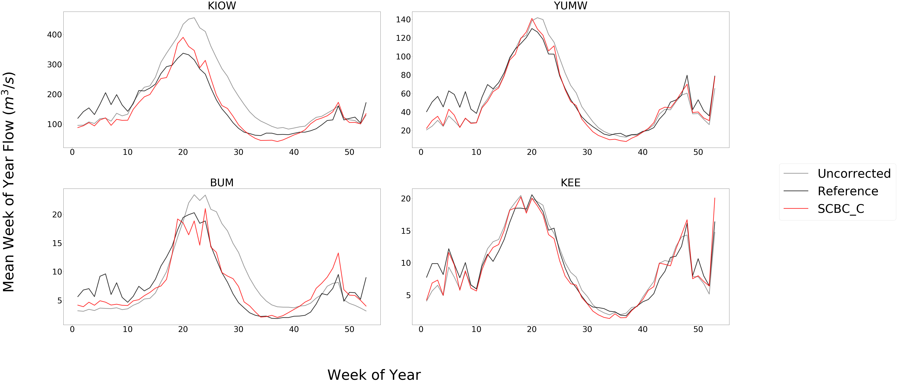
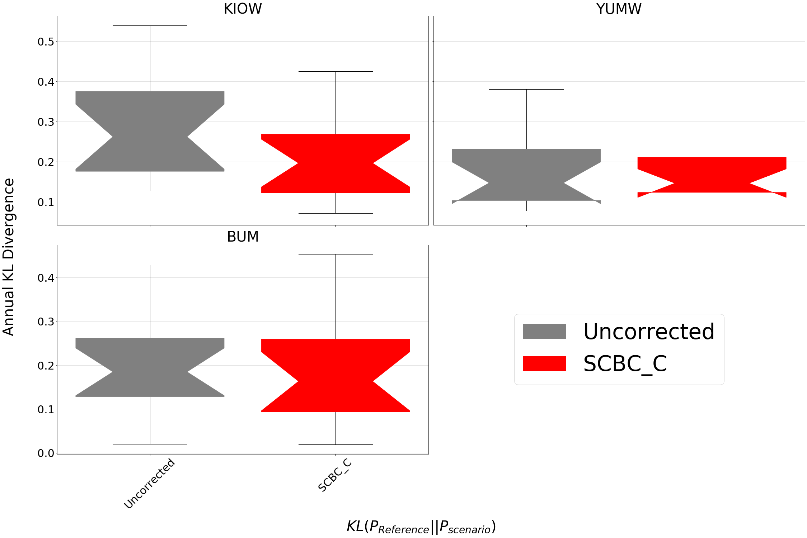

Evaluation of Bias Correction
=============================

Fundamental Statistics
----------------------

Below are the statistics used in ``bmorph`` to evaluate bias correction performance.
Let **P** be predicted values, such as the corrected flows, and **O** be the observed values, such as reference flows.

Mean Bias Error (MBE)
^^^^^^^^^^^^^^^^^^^^^

.. math::
    
    MBE = \frac{\Sigma_{i=0}^{n}(P_i - O_i)}{n}
    
Mean Bias Error is useful for preserving directionality of bias, yet may hide bias if both positive and negative bias exist in a dataset. MBE is therefore useful to determine how well biases balance out if you are only interested in the net or cumulative behavior of a system. This method is recommended against if looking to describe local changes without fine discritization to minimize biases canceling each other out.
    

Root Mean Square Error (RMSE)
^^^^^^^^^^^^^^^^^^^^^^^^^^^^^

.. math::

    RMSE = \sqrt{\frac{\Sigma_{i=0}^{n}(P_i - O_i)^2}{n}}
    
Root Mean Square Error perserves magnitudes over directionality, unlike MBE. This method is highly recommended when looking to reduce abosolute bias, but can result in overfitting models to a system.

Percent Bias (PB)
^^^^^^^^^^^^^^^^^

    PB = 100% * \frac{\Sigma_{i=0}^{n}(P_i - O_i)}{\Sigma_{i=0}^{n}O_i}
    
Percent Bias preserves direction like MBE, but aims to describe relative error instead of finite error. PB is often used when analyzing performance across sites with different magnitudes that are only a matter of scale. Because direction is preserved, the issue of positive and negative biases canceling out arises again here like in MBE.
    
Kullback-Leibler Divergence (KL Divergence)
^^^^^^^^^^^^^^^^^^^^^^^^^^^^^^^^^^^^^^^^^^^

Kullback-Leibler Divergence, or relative entropy, is used to describe how similar predicted and observation distributions are. Taken from Information Theory, KL Divergence describes the error in using one probability distribution in place of another, turning out to be a strong statistic to analyze how ``bmorph`` corrects probability distrubtions of stream flows. A KL Divergence value of 0 symbolizes a perfect match between the two probability distributions, or no error in assuming the one distrution in place of the other.

Kling-Gupta Efficiency (KGE)
^^^^^^^^^^^^^^^^^^^^^^^^^^^^

.. math::
    
    KGE = 1 - \sqrt{(r-1)^2 + (\frac{\sigma_{P}}{\sigma_{O}}-1)^2 + (\frac{\mu_{P}}{\mu}_{O}-1)^2}

The Kling-Gupta compares predicted flows to observed flows by combining linear correlations, flow variability, and bias (Knoben et. al. 2019). A KGE value of 1 represents predicted flows matching observed flows perfectly. Unlike Nash-Sutcliffe efficiency (NSE) values, there is no inherent benchmark in KGE values that describes "bad" predicted flows, so this measure needs to be used relative to raw flows as a benchmark (Knoben et. al 2019).

Plotting
--------

The ``Evaluation`` package of ``bmorph`` comes with a number of helpful plotting tools to analyze bias correction performance. Whether you want to compare corrected to uncorrected values, contrast different bias correction parameters, or simply compile your results into a tidy plot across multiple sites, there are plenty of plotting functions to choose from. You can find plotting functions `here <https://bmorph.readthedocs.io/en/develop/api.html#module-bmorph.evaluation.plotting>`_.

Scatter
^^^^^^^

 to 1 and -1 to 1 lines are plotted for reference.
    
Scatter plots are most useful for comparing absolute error before and after bias correction. The above plot is produced from ``compare_correction_scatter`` to compare how absolute error changes with each of the four `bias correction methods <bias_correction.rst/bmorph Overview>`_. 1 to 1 and -1 to 1 lines are plotted for reference, as points plotted vertically between the lines demonstrates a reduction in absolute error while points plotted horizontally between the lines demonstrates an increase in abosulte error for each flow time.

Time Series
^^^^^^^^^^^

    
Time Series plots are inherent to hydrologic plotting for visualizing flows throughout the year. The above plot is produced from ``plot_reduced_flows`` to compare a statistical representation of the flows at each site, (mean in this case), for raw, reference, and bias corrected flows according to the four `bias correction methods <bias_correction.rst/bmorph Overview>`_. Here, averages are computed on weekly intervals to simplify the figure, but can also be plotted on daily or monthly intervals for more or less granularity. Comparing this with median flows can describe how much the mean is impacted by extreme flows. 

Probabilty Distribtuions
^^^^^^^^^^^^^^^^^^^^^^^^

    
Probability Distributions being widley used in hydrologic planning are essential for comparing bis correction methods. The above plot is produced from ``compare_mean_grouped_CPD`` to compare cumulative percentile distributions of mean annual flow at each site for raw, refererence, and bias corrected flows according to the four `bias correction methods <bias_correction.rst/bmorph Overview>`_. This function is also capable of subsetting data by month should you want to compare only Januaray flows for example. Because ``bmorph`` makes changes based on flow distributions, this plot is the closest to directly analyzing how the different methods correct flows.

Box & Whisker
^^^^^^^^^^^^^

    
Box & Whisker plots are useful for representing statistics that only require a single axis such as `KL Divergence <Kullback-Leibler Divergence (KL Divergence)>`_ or `KGE <Kling-Gupta Efficiency (KGE)>`_. The above plot is produced from ``kl_divergence_annual_compare`` to compare KL Divergence with respect to reference flows for raw and the four `bias correction methods <bias_correction.rst/bmorph Overview>`_. Being able to view KL Divergence for different scenarios side-by-side helps to provide a better understanding of how well probability distributions are being fitted across the entire time provided.

Simple River Network
--------------------

The Simple River Network, or SRN, is a graphical, psuedo-physical diagnostic tool used to visualize watershed models. Utilizing <NetworkX's <https://networkx.org/>`_ nodal network structure, SRNs represent each river segment, or <seg <data.rst/Common Naming Conventions>`_, as a singular SegNode and connects them according to the watershed's topology. Each SRN is color-codable to assigned data values, such as percent bias, so you can visualize where issues may appear in the watershed during ``bmorph`` bias correction to more easily understand spatial patterns of bias correction in the network. 

SRN SegNode's contain identifying information that allow the network to be partitioned according to Pfaffstetter Codes (Verdin & Verdin 1999, Arge et. al. 2006). Pfaffstetter enconding not only allows the networks to be partitioned, but also to be "rolled up", effectively reducing the granularity of the network to simplify large watersheds. Data can also be subsected and split into new SRN's for simple manipulation.

SRN does not aim to supplant geographically accurate drawings of watershed networks. Instead it aims to provide a quicker, intermediate tool that allows for easy identification of spatial patterns within the network without having to configure spatial data. 

Citations
---------

Arge, L., Danner, A., Haverkort, H., & Zeh, N. (2006). I/O-Efficient Hierarchial Watershed Decomposition og Grid Terrain Models. In A. Riedl, W. Kainz, G.A. Elmes (Eds.), *Progress in Spatial Data Handling* (pp. 825-844). Springer, Berlin, Heidelberg. https://doi.org/10.1007/3-540-35589-8_51_

Knoben, W. J. M., Freer, J. E., & Woods, R. A. (2019). Technical note: Inherent benchmark or not? Comparing Nash-Sutcliffe and Kling-Gupta efficiency scores. *Hydrology and Earth System Sciences, 23*, 4323-4331.  https://doi.org/10.5194/hess-23-4323-2019_

Verdin, K.L., & Verdin, J. P. (1999). A topological system for delineation and codification of the Earth's river basins. *Elsevier Journal of Hydrology, 218*, 1-12. 

