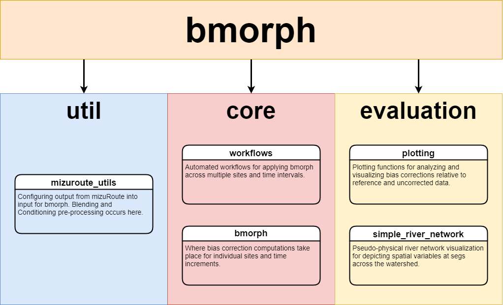

.. _index:

bmorph
######

bmorph is a package for streamflow bias correction. bmorph is designed to work in conjunction with the `mizuRoute <https://mizuroute.readthedocs.io/en/latest/>`_ streamflow routing model. 
bmorph provides methods for performing bias corrections that are spatially consistent as well as offers methods which can account for process-dependent biases.
We discuss bmorph's methodological details on the `bias correction page<https://bmorph.readthedocs.io/en/develop/bias_correction.html>`_.
For an overview of the structure of bmorph, see the package overview, below.

Installation
============
We provide a conda environment in ``environment.yml``. You can build the environment by running:

``conda env create -f environment.yml``

Then, to install bmorph run,

.. code-block::

   conda activate bmorph
   python setup.py develop
   python -m ipykernel install --user --name bmorph

Getting started
===============

You can run through our interactive tutorial `here <https://notebooks.gesis.org/binder/badge_logo.svg)](https://notebooks.gesis.org/binder/v2/gh/UW-Hydro/bmorph/develop>`_.
A static version of the tutorial can be found `here <https://bmorph.readthedocs.io/en/develop/bmorph_tutorial.html>`_.

bmorph Overview
===============

describes workflows as "Automated workflows for applying bmorph across multiple sites and time intervals" and bmorph as "Where bias correction computations take place for individual site and time increments." evaluation describes plotting as "Plotting functions for analyzing and visualizing bias corrections relative to reference and uncorrected data" and simple_river_network as "Pseudo-physical river network visualization for depicting spatial variables at stream segments across the watershed."
    
``core``
--------
The ``core`` directory is where the functions for performing bias correction are located. 
The ``bmorph.py`` module contains the functions for individual bias corrections. 
``workflows.py`` contains the functions that define some helper workflows that make it easier to apply bias corrections across a stream network.
More on the specifics of how bias correction is performed can be found in the `Bias Correction <bias_correction.html>`_ page.

``util``
--------
The ``util`` directory contains the ``mizuroute_utils.py`` module for organizing data exported by mizuRoute into an easily accessible form for ``bmorph``. 
More on how data is handled can be found on the `Data Overview <https://bmorph.readthedocs.io/en/develop/data.html>`_ page.

``evaluation``
--------------
The ``evaluation`` directory provides tools for plotting and analyzing results. 
More on plotting functions and implemented statistics can be found on the `Evaluation of Bias Correction <evaluation.html>`_ page. 
More on the Simple River Network tool can be found on the `Simple River Network (SRN) <srn.html>`_ page.

Sitemap
=======
.. toctree::
    
    self
    bias_correction
    bmorph_tutorial
    overview
    data
    evaluation
    srn
    for_developers
    api
