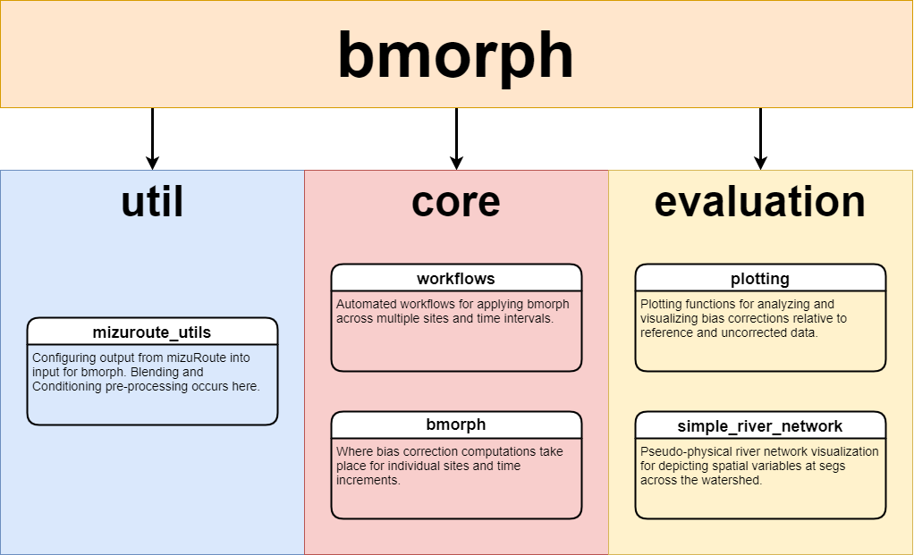

Package Overview
================

describes workflows as "Automated workflows for applying bmorph across multiple sites and time intervals" and bmorph as "Where bias corection compuations take place for individual site and time increments." evaluation describes plotting as "Plotting functions for analyzing and visualizing bias corrections relative to refernce and uncorrected data" and simple_river_network as "Pseudo-physical river network visualization for depciting spatial variables at segs across the watershed."
    

``util``
--------

The ``util`` directiory contains ``mizuroute_utils``, a fundamental Python script for organizing data exported by mizuRoute into an easily accesible form for ``bmorph``. More on how data is handled can be found on the `Data Overview <data.html>`_ page of the documentation.

``core``
--------

The ``core`` directory handles the bias correction aspects in the Python script ``bmorph`` and application of corrections to entire watersheds time series in the Python script ``workflows``. More on how bias correction is performed can be found in the `Bias Correction <bias_correction.html>`_ page of the documentation.

``evaluation``
--------------

The ``evaluation`` directory provides tools for plotting and analyzing results from ``core`` in the Python scripts ``plotting`` and ``simple_river_network``. More on plotting functions and implemented statistics can be found on the `Evaluation of Bias Correction <evaluation.html>`_ page of the documentation. More on the Simple River Network tool can be found on the `Simple River Network (SRN) <srn.html>`_ page of the documentation.